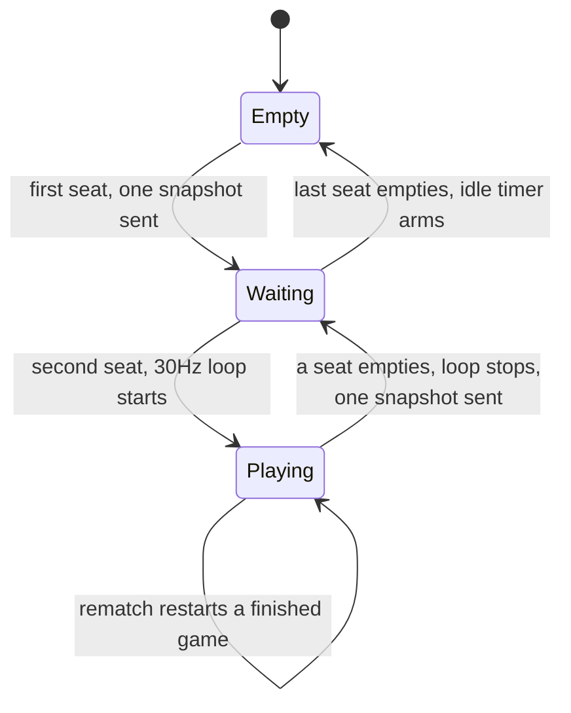
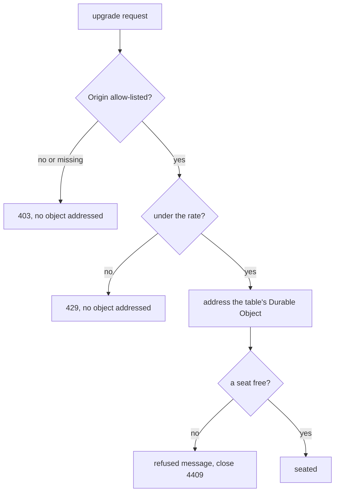

# Plan: Make the table server safe to publish, and let a finished game be played again

- **Slug:** harden-and-rematch
- **Branch:** feature/harden-and-rematch
- **Status:** built

## Intent

Two things stand between the multiplayer game and being switched on, both
escalated out of the `multi-player` work item and both settled by the user.

**The table Worker cannot be published as it stands.** `npm run deploy:table`
would put a public, unauthenticated endpoint on the internet where any client can
create unbounded Durable Objects, each held resident and duration-billed for as
long as a socket stays open, each broadcasting at 30 Hz even with one seat
filled — and the idle timer only arms when the *last* socket closes, so a client
that never disconnects is never reclaimed. The blast radius is the account
owner's bill. Nothing is exposed yet, because the Worker has never been deployed;
this is the work that makes deploying it defensible.

**And a table game that has been won cannot be played again.** Two people who
reach eleven are stuck on a dead court while the page hint and the README both
tell them a key press starts another. `startGame` is reachable only when an
arriving socket takes the second seat, so today the only way out is for somebody
to leave.

Both land in the same two modules, which is why they are one work item rather
than two pipeline runs over the same files.

## Acceptance criteria

- [ ] AC1: When two players finish a game at a table, either of them can start
      another with the gesture the page already offers — a key, a click or a tap.
      Both browsers then show 0-0, a ball in play, and no winner line.
- [ ] AC2: A `rematch` message changes nothing when it should not: sent
      mid-rally, or sent by a socket that holds no seat, the score and the phase
      are exactly what they were.
- [ ] AC3: A table with only one player seated does not broadcast on a timer.
      Measured by counting snapshots at a single seated client over five seconds
      of wall clock: at most two arrive (the one on seating, and one if the other
      seat changes). Today roughly 145 arrive.
- [ ] AC4: A table with one player still shows that player the court and the
      score rather than a blank canvas — the snapshot on seating and on the other
      seat changing is what AC3 leaves in place, and this is the guard that AC3's
      fix did not take it away.
- [ ] AC5: When the second player arrives the broadcast resumes at its normal
      rate, and when one of the two leaves it stops again. Measured the same way:
      roughly 30 snapshots a second with both seats filled, at most a handful in
      the five seconds after one leaves.
- [ ] AC6: A WebSocket upgrade whose `Origin` is not on the allow-list is refused
      before any Durable Object is addressed, and one carrying the site's
      canonical origin, a Pages preview subdomain, or a localhost development
      origin is accepted. A request with no `Origin` at all is refused.
- [ ] AC7: Beyond the configured rate, further upgrade attempts from one address
      are refused with `429`, and a game already in progress is not disturbed by
      somebody else being rate limited.
- [ ] AC8: Everything the `multi-player` work item established still holds. The
      full suite passes with no test weakened and no existing assertion changed.

## Non-goals

- **Deploying.** This work item makes `deploy:table` defensible; running it stays
  the user's call, as it was in `multi-player`.
- **Player authentication or accounts.** A table id is still the only credential,
  which is what the user asked for. This work stops a stranger running up a bill,
  not a stranger guessing "Johnny-13224".
- **Reconnecting to a game in progress**, still. A dropped player still frees
  their seat.
- **The chooser returning after a refusal or a lost connection** — a recorded
  follow-up from `multi-player` that needs a real "leave the table" path (stop
  the frame loop, tear down the socket, clear `started`). Bigger than this, and
  unrelated to either half of it.
- **`MAX_FRAME_MS` being defined twice.** Deliberately left in `multi-player`:
  the client's reason and the server's share a number but not a decision.
- Anything about single player, the CPU, the physics or the layout.

## Open questions

None. Four things were decided here rather than asked, because the user asked for
the work to continue rather than to be consulted, and none of them changes the
shape of it:

- **Either player may call a rematch**, and the other is simply taken into the
  new game. Both-must-agree needs a handshake, a waiting state and its own UI,
  and single player already restarts on any key — this is the same gesture.
- **The allow-list is a `var`, not a constant**, so adding a domain is a config
  change rather than a code change.
- **The rate is 30 upgrades per minute per address.** A real player upgrades once
  and stays; 30 is far past honest use — including a flaky connection retrying —
  and far below what makes an unbounded fleet of tables worth attempting.
- **A missing `Origin` is refused**, not waved through. Every browser sends one
  on a WebSocket upgrade; a request without one is not the game's client.

## Approach

### The rematch

`ClientMessage` is `{kind:'input'}` and nothing else, so there is no way to ask
for anything. It gains `{kind:'rematch'}`, with a parser as suspicious as the
existing one.

The server's rule is small because `startGame` already carries most of it: it
returns the state untouched unless the phase is `idle` or `game-over`, so a
rematch arriving mid-rally is a no-op without a guard being written for it (C6).
What the handler adds is the seat check — a socket with no seat cannot ask — and
a broadcast so both ends see the new game at once rather than a tick later.

On the client, the gesture already exists. `start()` returns early at a table
because starting is the server's business; it now sends `rematch` instead when
the game is over.

### Not broadcasting to an empty room

`startLoop()` is called unconditionally at the end of `seat()`, and `stopLoop()`
only when the last seat empties, so a single player sitting alone at a table
holds a 30 Hz interval open for as long as they like. The simulation advances
nothing in that state — the build notes for `multi-player` say the ball moves
only while both paddles are held — so every one of those frames carries the same
court.

The loop becomes conditional on both seats being filled. A snapshot is still sent
on seating and whenever the other seat changes, which is what keeps a waiting
player looking at a court instead of a blank canvas (AC4).

### Two locks on the door, and only one of them is real

**The `Origin` check is hygiene.** Browsers send `Origin` on a WebSocket upgrade
and cannot be talked out of it, so an allow-list stops another site embedding
this game's server and stops casual cross-origin use. It stops nothing else: a
script with `curl` sets whatever `Origin` it likes, or none. Anyone reading this
should not mistake it for the protection.

**The rate limit is the protection.** Cloudflare's native binding counts by a key
this Worker chooses — `CF-Connecting-IP` — and is enforced at the edge before the
Durable Object is addressed, which is the only place a refusal costs nothing.

Both checks belong at the Worker entry, before `env.TABLE.get(...)`, because a
Durable Object that has been addressed has already been created.

**Claims** — C3 and C4 were measured against real tooling and a real account
while this plan was written; the rest are read off the repository.

- [ ] C1: `ClientMessage` in `src/net/protocol.ts` is `{kind:'input'; input:
      Input}` and nothing else, so no other request can be made of a table today.
- [ ] C2: `worker/table.ts` calls `startLoop()` unconditionally at the end of
      `seat()` and `stopLoop()` only when `seats.size === 0` in `vacate()`.
- [ ] C3: Cloudflare's rate-limit binding is available to this wrangler and this
      account. `wrangler deploy --dry-run` over a `[[ratelimits]]` block reported
      `env.LIMITER (20 requests/60s)  Rate Limit`. **The field is `name`, not
      `binding`** — the opposite of every other binding type, and `binding` is
      rejected outright.
- [ ] C4: The site's origins are `https://pong-3su.pages.dev` and per-deployment
      previews of the form `https://<8 hex>.pong-3su.pages.dev` — three exist
      today (`5355cd3f`, `6b383932`, `f227a756`). An exact-match list would
      refuse every preview deploy, so the allow-list has to admit the pattern.
- [ ] C5: `Origin` is browser-enforced only. A non-browser client omits or forges
      it at will, so AC6 buys hygiene and AC7 buys the protection.
- [ ] C6: `startGame` in `src/game/state.ts` returns its argument unchanged
      unless the phase is `idle` or `game-over`, so a rematch mid-rally is
      already inert.
- [ ] C7: The rate-limit binding may not be simulated by `wrangler dev`. If it is
      absent locally the entry must fail **open** so the suite can run, which
      means AC7's refusal path needs a test that does not depend on the real
      binding — see *Test strategy*.

## Steps

- [x] S1: Add `{kind:'rematch'}` to `ClientMessage` and its parser, with unit
      tests for the shapes that must be rejected.
- [x] S2: Handle it in the Durable Object — seat check, `startGame`, broadcast.
- [x] S3: Send it from the client when the gesture arrives at a finished table,
      and correct the hint and README wording if they still overpromise.
- [x] S4: Run the broadcast loop only while both seats are filled; send a
      snapshot on seating and on the other seat changing.
- [x] S5: Add the `Origin` allow-list at the Worker entry, driven by a `var`
      carrying the canonical origin, the preview pattern and the dev origins.
- [x] S6: Add the `[[ratelimits]]` binding — `name`, per C3 — and the check at
      the entry, keyed by `CF-Connecting-IP`, failing open when the binding is
      absent so `wrangler dev` still works.
- [x] S7: Tests for AC1 through AC7, including the snapshot counting AC3 and AC5
      need.
- [x] S8: Full suite, both projects, and again in the CI Linux image.

## Test strategy

The `multi-player` harness already has what most of this needs: two and three
browser contexts against a real `wrangler dev` Durable Object, and a
`window.WebSocket` shim that the tests own. Counting snapshots is a small
addition to that shim.

- **AC1, AC2** — two contexts play to a finish (the suite already drives a game
  to `game-over`), then one presses a key; both browsers are asserted at 0-0 with
  a moving ball and no winner line. AC2 sends `rematch` mid-rally through the
  shim and asserts nothing moved.
- **AC3, AC4, AC5** — the shim counts `snapshot` messages. One seat: at most two
  in five seconds, and a court is still drawn. Two seats: about 30 a second. One
  leaves: the count stops climbing. These are rate assertions on a real clock, so
  they get generous bounds and are the ones most likely to flake — the ten-run
  bar from `multi-player` applies.
- **AC6** — an upgrade from a disallowed origin, driven directly rather than
  through a page, asserting `403` and — the part that matters — that no Durable
  Object was addressed.
- **AC7** — per C7, the binding may not exist under `wrangler dev`. The rate
  decision therefore goes behind a small seam the entry calls, so a unit test can
  drive the refusal with a fake limiter, and an e2e test asserts only that the
  seam is wired and fails open when the binding is missing. **If the binding does
  turn out to be simulated locally, test it for real instead and say so** — a
  seam tested with a fake is weaker evidence than the thing itself.
- **AC8** — the existing suite, unmodified.

**Run it on Linux.** Two work items ago a real defect survived six lenses, the
judge and the recheck because everything ran on macOS. Anything concluded here
about the runtime must be confirmed in the CI image.

## Build notes

- **S1 done.** `ClientMessage` is a union now, and `parseClientMessage`
  switches on `kind` the way `parseServerMessage` already did rather than
  growing a second `if`. A rematch carries nothing, so there is nothing to
  validate beyond the kind itself — which is exactly what the added rejection
  tests are about: `"rematch"`, `{kind:'Rematch'}`, `{kind:'rematch '}`,
  `{kind:['rematch']}`, `{rematch:true}` and `[{kind:'rematch'}]` are all
  dropped. C1 confirmed on the way in: `{kind:'input'}` really was the whole
  protocol.
- **S2 done.** `Table.rematch(slot, socket)` checks the socket still holds the
  seat, calls `startGame`, and broadcasts only if the game actually changed —
  `startGame` hands back the identical value when there is nothing to start
  (C6, confirmed), so a mid-rally rematch is inert *and* cannot be used to ask
  for a broadcast to both browsers over and over. The immediate broadcast is
  what AC1 needs: at a finished table there is no tick to carry the answer, for
  the reason S4 gives.
- **S3 done, with one thing put back.** The client sends `rematch` from the
  gesture it already had: `start()` keeps its phase guard, and at a table sends
  instead of starting. The socket moved to a module-level `table` because the
  controls are wired before any table is joined.
- **S3 deviation — the hint in `index.html` is unchanged.** It was reworded to
  say when a table game starts and that either player may start another, and
  that made the page 3.375 px too tall for an iPhone SE: `touch.spec.ts`
  "landscape AC5: an iPhone SE draws the court exactly as it did" went red on
  `belowTheScreen`, which is the landscape work item's guard that nothing falls
  off a small screen. The wording was reverted rather than the guard weakened.
  Nothing is lost: the hint said "press any key to start" and overpromised only
  because a table could not be restarted — the code, not the copy, is what makes
  it true now. The README carries the fuller explanation, where there is no
  layout to break.
- **S3 addition — the README.** A paragraph in *Playing somebody else* on the
  rematch, and the two new worker modules in the layout block.
- **S4 done.** `startLoop()` is called only on the second seat; `vacate()` stops
  it whichever seat went. A player alone gets one court on seating and one when
  the other seat empties, which is what AC4 asks for and what the existing AC7
  idle-timeout test reads its "abandoned" score from.
- **S4 note — the `seats.size === 2` branch in `simulateAndBroadcast` is gone.**
  With the loop conditional it was unreachable, and a dead branch that looks
  like a guard is worse than the invariant written down: the comment now says
  the loop only runs while both paddles are held, at both ends.
- **S5 done, and a module for it.** `worker/origins.ts` holds
  `originAllowed(origin, allowList)`, following `slots.ts`: the rule is a pure
  function so what it admits can be checked without a network, and
  `tests/unit/origins.test.ts` covers the site, previews, the dev servers, a
  missing origin, `null`, another project on `pages.dev`, a lookalike suffix, a
  two-label wildcard, a forged origin with a path where a label goes, the wrong
  scheme, the wrong port, and an allow-list that did not arrive.
- **S5 decision — an empty allow-list refuses everybody.** The opposite of the
  rate limit's fail-open, deliberately: a `var` that did not arrive is a mistake
  in this repository, while a binding that is not there is something the runtime
  withheld. Both are commented where they are decided.
- **S6 done — and C7 resolved the other way, which changed the design.**
  `wrangler dev --local` *does* simulate the rate-limit binding, and it really
  counts: `env.LIMITER (30 requests/60s) Rate Limit local`, and the 31st request
  in a minute came back 429. So AC7 is tested against the real binding and the
  shipped `wrangler.toml`, as the plan asked for if this turned out to be the
  case — no fake limiter in the behavioural test, and the seam is exercised with
  a fake only in the unit test.

### PLAN DEFECT — keying the limit purely on `CF-Connecting-IP` takes the suite down

The plan says (S6) to key on `CF-Connecting-IP` and fail open only when the
binding is absent. Both halves of that are unsafe here, and the reason is only
visible once the binding turns out to be simulated:

- **miniflare sets `CF-Connecting-IP` itself**, to `127.0.0.1` (verified by
  logging the header inside the Worker under `wrangler dev`). So the header is
  never absent locally, and the fail-open the plan describes never fires.
- **Every browser in the suite is that one address.** The behavioural suite
  opens well over thirty table sockets a minute between its workers, so the
  shipped allowance — thirty a minute per address, which the user settled —
  would refuse the suite's own sockets and take the whole regression wall red.
  Measured, not guessed: forty local requests in a row got thirty 426s and then
  429s.

What was built: `callerAddress(request)` returns `null` for a loopback address
as well as for a missing one, and `withinRate` fails open on `null`. A caller
cannot reach a deployed Worker from `127.0.0.1`, and cannot make Cloudflare's
edge say they did — the edge sets that header itself and overwrites what was
sent — so nothing that is exposed is unprotected by this. What it buys is that
the suite's browsers are not counted, while a test that says which address it is
speaking for is counted exactly like a real caller. That is what makes AC7 a
test of the real limiter rather than of a fake.

**The judge should put the carve-out to the user.** It is the one place where a
test's need shaped production code. The alternatives were worse and are recorded
here so they are not re-invented: a `var` that turns the limit off for the suite
is a kill switch shipped in production config; a separate `[env]` block with a
larger allowance means the suite no longer exercises the deployed configuration;
keying by table id instead would give a non-Cloudflare deployment no protection
at all against exactly the attack the limit exists to stop.

### Build notes (continued)

- **S7 done.** `tests/unit/origins.test.ts`, `tests/unit/limit.test.ts`,
  `tests/e2e/rematch.spec.ts` (AC1, AC2), `tests/e2e/broadcast.spec.ts` (AC3,
  AC4, AC5) and `tests/e2e/entry.spec.ts` (AC6, AC7).
- **S7 — AC1 is played, not forged.** Two browsers really do rally to eleven
  against the real Durable Object, which takes about 35 seconds of wall clock
  and needs its own test timeout. A forged game-over would have proved the
  browser draws a winner line, which is another work item's assertion, and
  nothing about the table.
- **S7 — every new assertion was checked against a broken build.** With
  `startLoop()` unconditional again the one-player count is 151 in five seconds
  (the plan predicted ~145) against a bar of 2; with the seating snapshot
  removed AC4 sees no court; with `vacate` leaving the loop running AC5's tail
  is 148; with the table ignoring `rematch` AC1 ends on `["10-11"]` and no 0-0;
  with the rematch made unconditional AC2's mid-rally history contains 0-0; with
  both entry checks ignored AC6 gets 426 where it wants 403 and AC7 never sees a
  429.
- **S7 — one assertion does *not* discriminate, and should be read that way.**
  AC2's "a socket that holds no seat" test still passes with the seat check
  deleted, because a refused browser's socket is closed by the table before it
  can say anything: the outcome AC2 names is asserted, the branch that would
  matter if that ever changed is not reachable from a browser to prove. Left in
  as the defence the plan asked for, recorded here rather than dressed up.
- **S7 — a rate assertion was hardened after it flaked.** AC7 originally sent a
  fixed 35 requests and asserted the tail was refused. It failed once in a full
  Linux run: the limiter counts over a period the runtime keeps for itself, and
  a burst that starts near the end of one spends part of its attempts in that
  period and the rest in the next. It now asks until three refusals in a row and
  asserts the door shuts no earlier than an allowance in — which is the property
  AC7 states, and is true whichever period the burst begins in.
- **S7 test-support deviations.** Three, all in `tests/e2e/support/`:
  `say(page, message)` sends over the page's own socket (the mirror of the
  existing `forge`), so the table's rules can be tested rather than the client's
  manners; `parkPaddleAtCentre` is the opposite of the existing
  `parkPaddleAtTop`, for a rally that has to last while it is looked at; and
  `sample()` in `pong.ts` now reads `__sounds?.length ?? 0`, because the
  two-browser pages read the ball off the canvas and never install the sound
  recorder. No assertion in any existing test changed.
- **S8 done. Suite green on both platforms.** 88 unit tests and 63 behavioural
  tests (chromium and mobile-chrome), on macOS/Node 22 and in a Linux
  `node:22-bookworm` container matching the CI job. Seven full runs on Linux and
  three on macOS; the new networked specs were repeated five times over
  (`--repeat-each`) on top of that, 29 targeted runs in all. The one failure
  seen anywhere is the AC7 flake described above, from before it was hardened.
- **Claims.** C1, C2, C5, C6 confirmed by reading the code they describe. C3
  confirmed and then some — the binding is not only deployable but simulated
  locally. C7 resolved the other way, as above. **C4 was not re-checked**: it
  was measured against the real Cloudflare account while the plan was written
  and this build has no access to that account, so the allow-list names
  `pong-3su.pages.dev` on the planner's evidence alone.
- **Discrepancy left alone for the judge.** The README's deploy table says the
  page lives at `https://pong.pages.dev` (project `pong`), while C4 measured
  `pong-3su.pages.dev` and the allow-list is written against C4. One of the two
  is stale. Correcting the table is a pre-existing documentation fix rather than
  this work item's, so the new README section refers to "the Pages domain in
  `worker/wrangler.toml`" rather than repeating either name — but **if C4 is
  wrong, every player on the deployed site is refused**, and that is worth the
  user confirming before `deploy:table` is run.
- **A consequence worth naming: one player alone can call a rematch.** The plan
  settles the rule as "either player may, and the other is taken into the new
  game", and the handler adds only the seat check — so a player sitting alone at
  a table whose game is over (their opponent left after the win) can put it back
  to 0-0. Harmless: nothing moves until a second player arrives, and `startGame`
  is a no-op on the game they would then be starting. Left as the plan has it
  rather than quietly adding a two-seat condition the plan does not ask for.
- **Not mine, committed with the work.** `docs/work/multi-player/state.json` was
  already modified in the working tree when this step started — the escalations
  E1-E4 being recorded as settled by `/quorum:1-plan`. Committed here so the
  tree is clean; nothing in it was written by this step.
