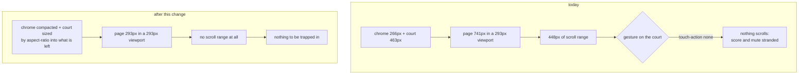

# Plan: Fit the game on a phone held sideways

- **Slug:** landscape-phone-layout
- **Branch:** fix/landscape-phone-layout
- **Status:** built

## Intent

Landscape is the way you hold a phone to play Pong, and it is the one way the
game does not work. Two problems, one cause.

The court does not fit. On a Pixel 5 in landscape the viewport is 293 px tall
and the court alone is drawn 463 px tall, so most of it is off screen. The page
chrome — title, score, status, mute button, hint, padding and gaps — takes a
further 266 px, which is nearly the whole viewport before the court gets a
single pixel. The stylesheet has no media queries and no viewport-relative
units anywhere, so nothing about the layout can respond to a short screen.

And since `touch-action: none` shipped in the previous work item, the player
cannot scroll to what is off screen either. There is a band of the scroll range
where the canvas fills the viewport, and a frozen canvas is one the page cannot
be scrolled from. Measured with real touch gestures at x = 8, 20, 100, 400, 700
and 780: every one leaves `scrollY` unchanged. The mute button and the score
are unreachable and it survives a reload.

The fix is to make the page fit, rather than to find a way to scroll it. A page
with no overflow has no scroll range, and a scroll range that does not exist
cannot trap anybody.

## Acceptance criteria

- [ ] AC1: When the game is loaded in a viewport 480 px tall or shorter — a
      Pixel 5 in landscape at 802×293 is the reference — the whole page fits
      without scrolling: `document.documentElement.scrollHeight` is no greater
      than `window.innerHeight`. Today that difference is 448 px.
- [ ] AC2: In that same landscape viewport, the mute button, both scores and the
      status line are all fully inside the viewport with no scrolling. Today the
      mute button sits at page y 650–685 in a 293 px viewport.
- [ ] AC3: The court is never drawn stretched. At every viewport tested, the
      rendered width divided by the rendered height is within 0.02 of 800/480
      (1.667). A naive `max-height: 100dvh` gives 2.628, which is the failure
      this criterion exists to catch.
- [ ] AC4: The landscape scroll trap is gone. Because AC1 leaves no scroll range
      in landscape, there is no scroll position from which the page cannot be
      scrolled — the condition is unreachable rather than escapable.
- [ ] AC5: Portrait is unchanged. On a Pixel 5 portrait (393×727) and an iPhone
      SE (348×618) the court renders at the same size it does today — 361×217
      and 288×174 respectively — and the page still does not scroll.
- [ ] AC6: The court declares `touch-action: pinch-zoom` rather than `none`. A
      one-finger drag on the court still drives the paddle and still does not pan
      or scroll the page, exactly as before; two-finger zoom is returned to the
      browser so the court can be magnified. **This deliberately supersedes AC3
      of the `mobile-touch-controls` work item**, which asserted the computed
      value is flatly `none`.
- [ ] AC7: Everything the earlier work items established still holds. The full
      existing suite passes with no test weakened, and the only assertion that
      changes is the superseded `touch-action` value in AC6.
- [ ] AC8: When a finger drags on the smaller landscape court, the paddle still
      lands under it — within one pixel of where it asks — so shrinking the court
      does not break the coordinate mapping.

## Non-goals

- **Redesigning portrait.** It already fits and it is how the original bug was
  reported. This work is keyed on viewport *height*, so portrait phones do not
  match the query at all.
- **A second layout for landscape** — chrome in a side column, or the score
  drawn onto the canvas. Both were considered and rejected in favour of
  compacting the existing column: one layout to reason about, and the overlay
  option would take the scoreboard out of the DOM and break the `aria-live`
  announcement that reads the score to screen readers.
- Orientation locking, fullscreen, or any install/PWA behaviour.
- Any change to the simulation, the physics, the CPU opponent or the sound.
- Making the court *large* in landscape. 280×168 is small but playable and it
  fits; winning back more space is what the rejected layouts above were for.

## Open questions

None. Three forks were put to the user and settled before this was written:

- *Which layout shape?* Compact the existing column. See Non-goals.
- *Keep `touch-action: none`?* No — relax to `pinch-zoom`, accepting that it
  supersedes a shipped acceptance criterion. AC6 records that explicitly.
- *What is it called?* `fix/landscape-phone-layout`.

## Approach

All of this lands in `src/style.css`, which today has no media query and no
viewport-relative unit in it. The change adds one `@media (max-height: 480px)`
block and gives the canvas a sizing rule that cannot distort it.

**Making it fit** is two independent things. The chrome shrinks — smaller title,
tighter body padding and flex gaps, smaller status text, and the hint paragraph
hidden, since a player on a phone is not reading keyboard shortcuts. The court
then takes what is left: `.game` becomes exactly one viewport tall, and the
canvas is `flex: 1 1 auto` with `min-height: 0` and `aspect-ratio: 800 / 480`,
so it shrinks into the remaining space and keeps its shape while doing it.

`aspect-ratio` is what makes this safe. Constraining height alone squashes the
canvas, because a canvas stretches its bitmap to whatever box CSS gives it —
that is exactly how `max-height: 100dvh` produces a 2.628 court. With the ratio
declared, both axes stay tied together however the box is constrained.

**The trap closes as a consequence**, not as a separate fix. Once the page fits,
`scrollHeight` equals `innerHeight`, there is no scroll range, and the question
of whether a gesture can escape one stops being askable.

**Claims** — C1 through C4 and C6 were measured against the running app while
this plan was written; C5 is read off the source.

- [x] C1: `src/style.css` contains no `@media` rule and no `vh`/`dvh` unit today,
      so there is no existing responsive structure to fit into or conflict with.
- [x] C2: `touch-action: pinch-zoom` on the court delivers a one-finger drag to
      the page exactly as `none` does — four `pointermove`s dispatched, four
      received, `scrollY` unmoved — so AC6 costs nothing in paddle behaviour.
- [x] C3: The compaction described above reaches `scrollHeight - innerHeight = 0`
      at 802×293, with the court at 280×168 and an aspect of 1.667.
- [x] C4: Pixel 5 portrait (727 px) and iPhone SE (618 px) do not match
      `max-height: 480px`, so both render exactly as they do today.
- [x] C5: The superseded assertion lives at `tests/e2e/touch.spec.ts:152` and
      checks `getComputedStyle(...).touchAction === 'none'` together with
      `overscroll-behavior`. Only the `touch-action` half changes; the
      `overscroll-behavior` half stays as it is.
- [x] C6: Landscape chrome measures 266 px today — body padding 64, flex gaps 48,
      scoreboard 38, controls 34, hint 30, title 28, status 24.

## Steps

- [x] S1: Add the `@media (max-height: 480px)` block to `src/style.css`:
      compacted padding, gaps, title, status, and the hint hidden.
- [x] S2: Give the canvas `aspect-ratio: 800 / 480` with flex sizing so it fills
      the remaining height without distorting. Confirm portrait is untouched.
- [x] S3: Relax the court to `touch-action: pinch-zoom`, with a comment saying
      what it buys and what it deliberately supersedes.
- [x] S4: Update the superseded half of the AC3 assertion in
      `tests/e2e/touch.spec.ts`, and say in a comment why the value changed
      rather than silently editing an expectation.
- [x] S5: Add landscape coverage — a `test.use({ viewport })` landscape block in
      the touch spec covering AC1, AC2, AC3, AC4 and AC8.
- [x] S6: Add a portrait-unchanged assertion for AC5, so a regression in the
      media query is caught rather than assumed absent.
- [x] S7: Run the full suite in both projects, and again in the CI Linux image.

## Test strategy

Behavioural, through the assembled application, in the manner already
established by `tests/e2e/touch.spec.ts`: drive the real page and measure the
rendered geometry, rather than asserting the CSS was written.

- **AC1, AC2, AC5** — read `scrollHeight`, `innerHeight` and the mute button's
  rect off the running page at a landscape viewport and at two portrait ones.
- **AC3** — compute rendered width ÷ height and compare to 1.667. This is the
  criterion that catches the distortion a height cap alone introduces, so it must
  assert the ratio and not merely that the court got smaller.
- **AC4** — assert the absence of a scroll range, which is what makes the trap
  unreachable. Do not attempt to prove it by scrolling and escaping: with no
  overflow there is nothing to scroll, and a test that gestured and found the
  page unmoved would pass for the wrong reason.
- **AC6** — computed `touch-action` is `pinch-zoom`, plus the existing one-finger
  drag tests continuing to pass unchanged, which is what shows the relaxation
  cost nothing.
- **AC8** — the existing `missedBy` helper against a drag on the landscape court.
- Landscape needs a viewport override rather than a new project: `hasTouch` comes
  from the `mobile-chrome` project and `test.use({ viewport })` can reshape it
  within that project.

**Run it on Linux before believing it.** The previous work item shipped a real
defect — tap-to-start dying after a drag — that passed six review lenses, the
judge and the recheck, because every one of them ran on macOS and the bug only
appears on Linux Chromium. CI caught it. Anything this work item concludes about
browser behaviour must be confirmed in the CI image, not only locally.

Every new test must be seen to fail with the change reverted, per `/tests:add`.

## Build notes

All seven steps are done. The suite is green: 41 unit tests and 43 Playwright
tests across both projects — 27 on Desktop Chrome, 16 on the phone — run on
macOS and again in the CI Linux image (`mcr.microsoft.com/playwright:v1.62.1-noble`,
`npm ci` from scratch), which is where the previous work item's defect only
showed up.

Measured after the change, at the plan's reference viewports:

| viewport | court | aspect | `scrollHeight - innerHeight` |
| --- | --- | --- | --- |
| 802x293 landscape | 319.3 x 191.6 | 1.667 | 0 (was 448) |
| 393x727 Pixel 5 upright | 361.0 x 217.4 | 1.661 | 0 (unchanged) |
| 320x568 iPhone SE upright | 288.0 x 173.6 | 1.659 | 0 (unchanged) |

### PLAN DEFECT: `flex: 1 1 auto` distorts the court on a narrow short screen

*Approach* specifies the canvas as `flex: 1 1 auto` with `min-height: 0` and
`aspect-ratio`, and S2 follows it. Written that way the court is stretched on
end at any viewport that matches `max-height: 480px` but is narrow — 300x460
gives 284 x 358.6, an aspect of **0.79**, which is AC3's failure in the other
direction. The cause is the `grow`: the item fills the column, the aspect ratio
asks for 1.667 times that height in width, `max-width: 100%` cuts the width back
on its own, and the height stays where growing put it. Nothing transfers the
width cap back to the height.

Built as `flex: 0 1 auto` instead — shrink but never grow. The canvas's own 480
is the basis, and a screen this query matches always has less than that to spare
once the chrome has taken its share, so there is always something to shrink out
of and the ratio is never broken. Measured at 1.667 (to four figures) at
802x293, 300x460, 320x480, 851x393, 667x375, 1200x200 and 200x200.

The plan's own reference viewport does not expose this: at 802x293 both spellings
give the identical 319.3 x 191.6, so the defect is invisible unless a narrow
short screen is measured. **What should happen:** nothing further — the
criterion AC3 is written against ("at every viewport tested") is met, and the
correction is one keyword. It is recorded here because *Approach* still names the
spelling that fails.

### Deviations

- **S1 — the page's height is a `dvh` calc, not a bare `100dvh` on `.game`.**
  *Approach* says `.game` becomes exactly one viewport tall. Left literally that
  is one viewport **plus** the body's padding, which overflows by exactly the
  padding and fails AC1. `.game` is `calc(100dvh - 2 * var(--page-padding-block))`
  and the body's block padding is the same custom property, so the two cannot
  drift apart.

- **S5/S6 — the new tests are titled `landscape ACn`.** `touch.spec.ts` already
  has tests named AC1 through AC8 for `mobile-touch-controls`, and this work item
  numbers its criteria from one again. The prefix keeps the two readable in one
  file; the plan did not say what to call them.

- **S6 — the iPhone SE case is `test.use({ viewport: { width: 320, height: 568 } })`.**
  AC5 names it "348x618", which is what `window.innerWidth`/`innerHeight` report
  for that viewport inside the `mobile-chrome` project (Pixel 5's device scale
  factor rescales the visual viewport). The court comes out at 288 x 173.6,
  exactly the "288x174" AC5 asks for, so the two halves of the criterion agree
  once the units are pinned down. A literal 348x618 viewport gives 316 x 190.4
  and would contradict the size AC5 states.

- **S7 — the Linux run is on Node 24, not the `.nvmrc` Node 20.** The Playwright
  image pins its own Node and CI pins 20. The Chromium is the CI image's, which
  is what the plan's warning is about; the unit suite is pure arithmetic and was
  run on macOS. Worth a second look if anything Node-version-shaped ever fails.

### Claim corrections

Both claims hold in substance; their arithmetic does not.

- **C6 counts four flex gaps where the layout has five.** `.game` has six
  children in landscape, so `gap: 0.75rem` is 60 px, not 48. Chrome measures
  **278 px** today, not 266 — 741 px of page against a 462.8 px court. The point
  the claim is making, that the chrome alone nearly fills the screen, is if
  anything stronger.

- **C3's court is 319.3 x 191.6, not 280 x 168.** The zero-overflow half is
  exact, and the aspect is 1.667 as claimed. The compaction landed a little
  lighter than whatever the plan was measured against — the numbers it lists are
  not reachable from the plan's own prose, which names which properties shrink
  but not what to. A larger court is the friendlier miss, and *Non-goals* rules
  out spending more effort winning space back.

### Falsifiability, per `/tests:add`

With `src/style.css` reverted to `HEAD` and the tests left as they are, all five
`landscape ACn` tests fail, along with the superseded `touch-action` assertion.
The two portrait `landscape AC5` tests are the exception by design — they assert
that nothing changed, so they pass before and after. They are covered by a
narrower mutation instead: widening the query to `max-height: 800px`, so it
catches a portrait phone, fails both of them.

Two further mutations, to show the landscape tests fail for the right reason
rather than merely failing:

- `canvas { max-height: 100dvh }` — the naive height cap AC3 exists to catch.
  Landscape AC3 fails on the ratio assertion, at 2.76.
- The unreverted stylesheet with the query left in place — landscape AC3's second
  assertion, that the court really was squeezed, is what fails on a court that
  fits by luck rather than by sizing.

### Left out deliberately

- No change to `index.html`. The hint is hidden by CSS rather than removed, so it
  is still read to a screen reader and still there when the phone is turned
  upright, and `.hint` remains the off-court drag target the existing AC5 test
  needs.
- No change to `playwright.config.ts`. `test.use({ viewport })` reshapes the
  screen inside `mobile-chrome` and keeps `hasTouch`, as the test strategy says.
- Nothing was done about the court being small in landscape. *Non-goals*.
