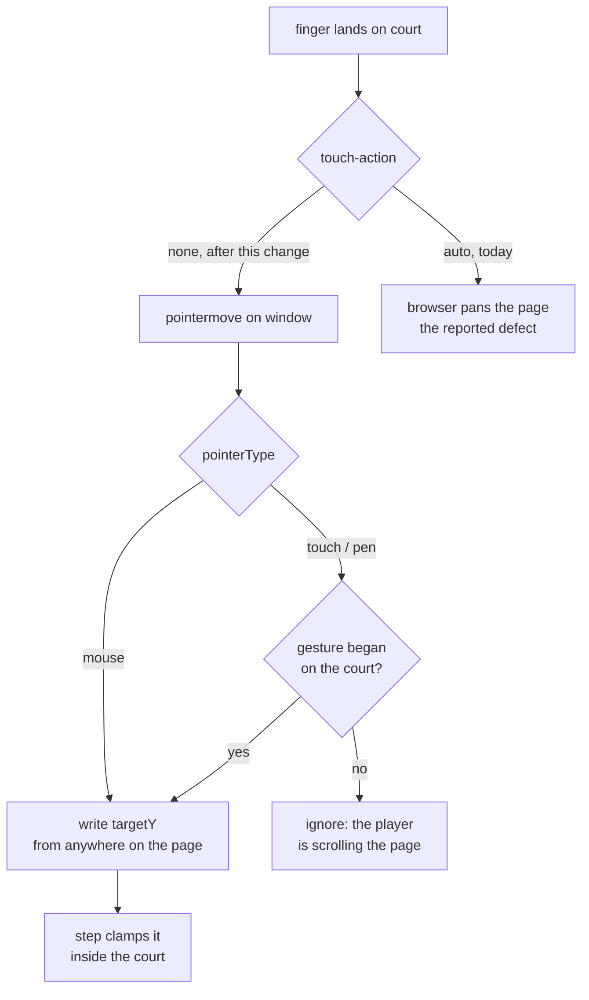

# Plan: Touch control for the paddle on mobile

- **Slug:** mobile-touch-controls
- **Branch:** fix/mobile-touch-controls
- **Status:** built

## Intent

The game is unplayable on a phone. In the user's words: "the app does not work
correctly on a mobile device. When the user touches the screen to try to control
the paddle on the y-axis, it just slides the entire app around. It should freeze
the app/canvas and honor touch events."

Both halves of that are the same root cause. There is no touch handling in the
codebase at all — `src/input.ts` listens for `mousemove` and `click`, and a
finger produces neither — so a drag reaches nothing in the game. Meanwhile the
canvas declares no `touch-action`, so the browser takes the drag as a pan and
moves the page under the player. The finger therefore does the one thing it must
not do and none of the thing it should.

The fix is to give the gesture to the game: the court stops being something the
browser pans, and a finger on the court drives the paddle exactly as the mouse
already does.

## Acceptance criteria

- [ ] AC1: When a finger touches the court and drags up and down, the player's
      paddle centres itself on the finger's vertical position and keeps tracking
      it as the finger moves, landing within one pixel of where the finger is
      asking — the same accuracy the mouse already achieves. The computer's
      paddle is unaffected.
- [ ] AC2: When a drag that began on the court carries the finger past the top or
      the bottom of the court, the paddle rests against that edge rather than
      being stranded where the finger crossed the boundary, and it never leaves
      the court.
- [ ] AC3: The court declares `touch-action: none` — observable as
      `getComputedStyle(document.getElementById('court')).touchAction === 'none'`
      — so the browser hands a gesture starting on the court to the game instead
      of panning or zooming the page with it. The page also declares
      `overscroll-behavior: none`, so a drag cannot rubber-band or trigger
      pull-to-refresh. Both are absent today, which is the defect being reported.
- [ ] AC4: When the canvas is displayed at a size other than its intrinsic
      800x480 — which is the normal case on a phone, where it is measured at
      roughly 217 px tall — the paddle lands under the finger rather than at a
      proportionally wrong height.
- [ ] AC5: When a touch gesture starts somewhere other than the court — the hint
      text, the page background, the score — the paddle does not move, and the
      page scrolls as it normally would. This is what keeps the mute button
      reachable in landscape, where the page is 741 px tall in a 293 px viewport
      and scrolling is the only way to reach it.
- [ ] AC6: When the player taps the court, the game starts and sound is
      available, exactly as a click or a key press does. Dragging a finger
      without tapping does not start the game and produces no sound.
- [ ] AC7: When the player drags a finger and then holds a movement key, the
      keyboard takes over; when they touch again, touch takes over. The most
      recent input wins, across touch, mouse and keys alike. Every existing mouse
      and keyboard behaviour is unchanged — the seven tests in
      `tests/e2e/mouse.spec.ts` still pass without modification.
- [ ] AC8: When the page is loaded twice with `?seed=1` and driven with the same
      inputs, the rally is identical. The simulation stays deterministic and
      frame-rate independent.

## Non-goals

- **A responsive redesign so the court fits a landscape phone.** Measured on a
  Pixel 5 in landscape, the court is drawn 463 px tall inside a 293 px viewport,
  so part of it is off screen and the player must scroll. That is a real
  playability problem and it is a separate work item — this change makes the
  court honour touch, it does not re-lay-out the page.
- Multi-touch: two-finger gestures, pinch, and anything reading more than the
  first active touch.
- On-screen controls — a virtual d-pad, tap zones, or buttons drawn on the court.
- Orientation locking, fullscreen, or any install/PWA behaviour.
- Gamepad support.
- Any change to the simulation, the physics, the CPU opponent or the sound.

## Open questions

None. Three forks were settled during investigation rather than left open:

- *Freeze the whole page, or only the court?* Only the court. Freezing the page
  would strand the mute button off screen in landscape, where the content
  genuinely overflows (measured above). AC3 and AC5 encode the split.
- *Should a touch drag start the game?* No — parity with the mouse, where moving
  does not start the game and a click does. AC6 encodes it.
- *Where does the paddle go when the finger lifts?* It stays where it was left,
  which is what the mouse already does with `targetY` and is consistent with the
  idle-paddle behaviour settled in the previous work item.

## Approach

The change is small and lands in four files. `src/input.ts` is the only place
that reads input, and it already has the right shape: a `targetY` in court pixels
that the mouse writes and `step()` clamps. Touch needs to write the same field.

**Freezing the court** is CSS, not JavaScript. `canvas { touch-action: none }`
in `src/style.css` is what tells the browser not to claim the gesture for
panning; `overscroll-behavior: none` on `html, body` stops rubber-banding and
pull-to-refresh. Calling `preventDefault()` on `touchmove` would be the wrong
tool here — those listeners are passive by default on `window`, so it would be
ignored unless explicitly opted out, whereas `touch-action` is declarative and
is what Safari and Chrome both honour.

**Honouring touch** means generalising the existing `mousemove` listener to
`pointermove`, which delivers mouse, touch and pen through one path. `courtY()`
needs no change — it maps a `clientY` through the canvas's box and does not care
what produced it.

The one subtlety is *which* pointers may drive the paddle. A mouse may drive it
from anywhere on the page, which is existing behaviour AC2 of the previous work
item depends on. A finger may not: a drag on the hint text is the player
scrolling, and hijacking it would break AC5. Touch gestures are distinguished by
where they began — during a touch drag the browser's implicit pointer capture
keeps `event.target` on the canvas even after the finger leaves it (verified;
see C4), so a window-level listener can tell the two apart without tracking
state by hand.

**Claims** — assertions about this repository that the approach rests on. C3, C4
and C7 were checked against a real Chromium during planning; C1, C2, C5 and C6
are read off the source and remain to be verified.

- [x] C1: `courtY(clientY, box)` in `src/input.ts` already scales correctly for a
      canvas displayed at other than its intrinsic size, and needs no change to
      serve touch — it takes a `clientY` from any source.
- [x] C2: No `touch-action`, `overscroll-behavior`, `touchstart`, `pointerdown`
      or `TouchEvent` handling exists anywhere in `src/`, `index.html` or
      `tests/` today. The court's computed `touch-action` on a phone viewport is
      `auto`.
- [x] C3: A tap on the court already synthesizes a `click`, so the existing
      `onClick` to `onStart` path in `src/input.ts` starts the game from a tap
      with no new code. AC6 is therefore mostly a regression test rather than new
      behaviour.
- [x] C4: During a touch drag that began on the canvas, implicit pointer capture
      keeps `event.target` as the canvas even after the finger moves well beyond
      it, so a `pointermove` listener on `window` can distinguish a
      court-originated gesture by target alone. No `pointercancel` arrives once
      `touch-action: none` is set.
- [x] C5: Replacing the `mousemove` listener with `pointermove` preserves mouse
      behaviour exactly, so the seven tests in `tests/e2e/mouse.spec.ts` pass
      unchanged.
- [x] C6: `playwright.config.ts` declares a single `chromium` project using
      `devices['Desktop Chrome']`, which has `hasTouch: false`. No touch test can
      run until a touch-capable project is added.
- [x] C7: Real touch panning is not reproducible in this harness.
      `Input.dispatchTouchEvent` delivers faithful pointer events but never
      scrolls the page, and `Input.synthesizeScrollGesture` scrolls regardless of
      `touch-action`. AC3 is therefore verified through computed style — the
      contract the browser actually acts on — and not by observing a page that
      failed to move.

## Steps

- [x] S1: Add a touch-capable Playwright project to `playwright.config.ts` using
      `devices['Pixel 5']`, scoped to the new touch spec so the existing suite
      keeps running on Desktop Chrome.
- [x] S2: Add touch scaffolding to `tests/e2e/support/pong.ts`: a CDP-driven
      `touchDrag` built on `Input.dispatchTouchEvent`, and a reader for a
      computed style property. Keep the existing helpers untouched.
- [x] S3: Freeze the court in `src/style.css` — `touch-action: none` on the
      canvas, `overscroll-behavior: none` on `html, body`.
- [x] S4: Generalise `src/input.ts` from `mousemove` to `pointermove`, admitting
      non-mouse pointers only when the gesture began on the court. Explain the
      asymmetry in a comment, as the file's existing comments do.
- [x] S5: Write `tests/e2e/touch.spec.ts` covering AC1 through AC6, modelled on
      the structure of `tests/e2e/mouse.spec.ts`.
- [x] S6: Extend the AC7 arbitration and AC8 determinism coverage to touch,
      alongside the existing mouse cases.
- [x] S7: Update the hint text in `index.html` to mention touch.
- [x] S8: Run the full suite — unit and both Playwright projects — and confirm
      the existing mouse, keyboard, collision, scoring and smoothness specs pass
      unchanged.

## Test strategy

Behavioural, through the assembled application, in the manner already
established by `tests/e2e/mouse.spec.ts`: drive the real page, then read the
paddle back off the canvas by its colour with `paddleAt`.

- **AC1, AC2, AC4, AC5, AC7** — touch drags via CDP `Input.dispatchTouchEvent`
  in a `hasTouch` context, asserted against `paddleAt`. This delivers genuine
  pointer events with `pointerType: 'touch'`, including implicit capture, so it
  exercises the real code path.
- **AC3** — computed style on the assembled page. Per C7, the harness cannot
  reproduce real touch panning in either direction, so asserting "the page did
  not scroll" would pass whether or not the fix were present. Asserting the
  declaration is the honest test: it is falsifiable, it fails today, and it is
  precisely the contract the browser acts on. The actual no-panning behaviour
  needs a manual check on a device, which is called out rather than implied.
- **AC6** — `page.touchscreen.tap()`, asserting the status line clears and that
  the first recorded sound has `connectedToDestination: true`, exactly as the
  existing mouse AC6 test does.
- **AC8** — the existing seeded-replay pattern from `mouse.spec.ts`, extended
  with a scripted touch drag.
- **Unit** — `courtY` is already covered in `tests/unit/input.test.ts` and needs
  no new cases; it is unchanged by this work. If S4 extracts a predicate for
  "may this pointer drive the paddle", that predicate is pure and gets unit
  tests.

Every new test must be seen to fail with the fix reverted, per `/tests:add`.

## Build notes

All eight steps are done and every claim C1–C7 held. The full suite is green:
41 unit tests, and 36 Playwright tests across both projects — 27 on Desktop
Chrome, 9 on the phone. Run twice end to end, green both times.

- **S1/S2 ordering:** the phone lives in `tests/e2e/support/pong.ts` as
  `TOUCH_DEVICE`, and `playwright.config.ts` imports it rather than naming
  `devices['Pixel 5']` inline. `browser.newContext()` does not inherit a
  project's device options, so the AC8 determinism test has to build its own
  touch contexts; a second copy of the device in the spec would drift from the
  project the other eight tests run in. One definition, two importers.

- **S2 deviation — the drag has to wait to be seen.** The plan's test strategy
  took `Input.dispatchTouchEvent` to be enough on its own. It is not, under this
  suite's frozen clock. Chromium delivers touch moves on the browser's own
  frames, which the paused clock does not drive, so a move dispatched now
  reaches the page slightly *after* `runFrames` has run the game forward: the
  paddle read back is one move behind, and two runs of the same script disagree
  about where it was. AC1, AC2, AC7 and AC8 all failed on it. `finger.moveTo`
  now waits for the page to have seen the move — the page counts its own
  `pointermove`s and Node polls that count on the real clock, since the page's
  timers and animation frames are the frozen ones and `waitForFunction` would
  never poll. A gesture the browser rules a scroll ends in `pointercancel` and
  sends nothing more, so a recorded cancel ends the wait too. This is test
  scaffolding only; no production code depends on it.

- **S2 deviation — `finger` as well as `touchDrag`.** The plan named one helper.
  The interesting assertions are mid-drag — where the paddle is after this move,
  before the next — and frames have to run between them, which a single
  whole-gesture call cannot express. So `finger` is the primitive (down, moveTo,
  up) and `touchDrag` is three lines on top of it. Both are used.

- **S4:** `drivesPaddle(pointerType, startedOnCourt)` was extracted, as the test
  strategy anticipated, and unit-tested in `tests/unit/input.test.ts`. A pen is
  treated as a finger: it is a direct-manipulation pointer whose gesture the
  browser may want for scrolling, and admitting it from anywhere would break the
  same AC5 a finger would.

- **S4 decision, not oversight:** a finger that lands and does not move leaves
  the paddle where it was — only `pointermove` writes `targetY`, which is what
  "generalising the existing `mousemove` listener" means, and it is the same
  answer the plan settled for where the paddle goes when the finger lifts. AC6
  asserts it: after a tap somewhere else, the paddle is still where the drag
  left it.

- **S5:** `centreOf`, `downCourt`, `courtYOf` and `missedBy` are duplicated from
  `mouse.spec.ts` rather than lifted into `support/pong.ts`. Sharing them means
  editing `mouse.spec.ts`, and AC7 requires those seven tests to pass
  *unchanged*. Four lines of arithmetic is the cheaper price.

- **S6:** the touch AC7 and AC8 cases are in `touch.spec.ts`, not next to the
  mouse cases in `mouse.spec.ts`. The `chromium` project has `hasTouch: false`,
  so a touch case cannot run there at all. The mouse cases are untouched and
  still cover the mouse-versus-keys half of AC7.

- **Falsifiability, per `/tests:add`.** With `src/input.ts` and `src/style.css`
  reverted to `HEAD`, seven of the nine new touch tests fail. The two that do
  not are covered by narrower reverts:
  - **AC5** asserts the paddle does *not* move, so a revert that removes touch
    handling altogether passes it. Weakening `drivesPaddle` to admit every
    pointer was the honest revert: AC5 then fails, the paddle jumping to
    `{top: 9}` on a drag that began on the hint text.
  - **AC8** is a determinism guard rather than a touch feature, exactly like the
    mouse AC7 case it is modelled on, and a rally with no touch handling is
    still deterministic. It fails on the delivery race described above, which is
    what it is there to catch.
  - The `overscroll-behavior` half of AC3 was reverted on its own and fails
    (`auto`), so neither half of that test is carried by the other.

- **Still needs a human on a real phone.** Per C7 the harness cannot reproduce
  touch panning in either direction, so AC3 is verified through the computed
  declaration the browser acts on. That the page no longer slides under the
  finger — the reported defect — has not been observed, here or anywhere. It
  wants one minute on a device before this ships.
