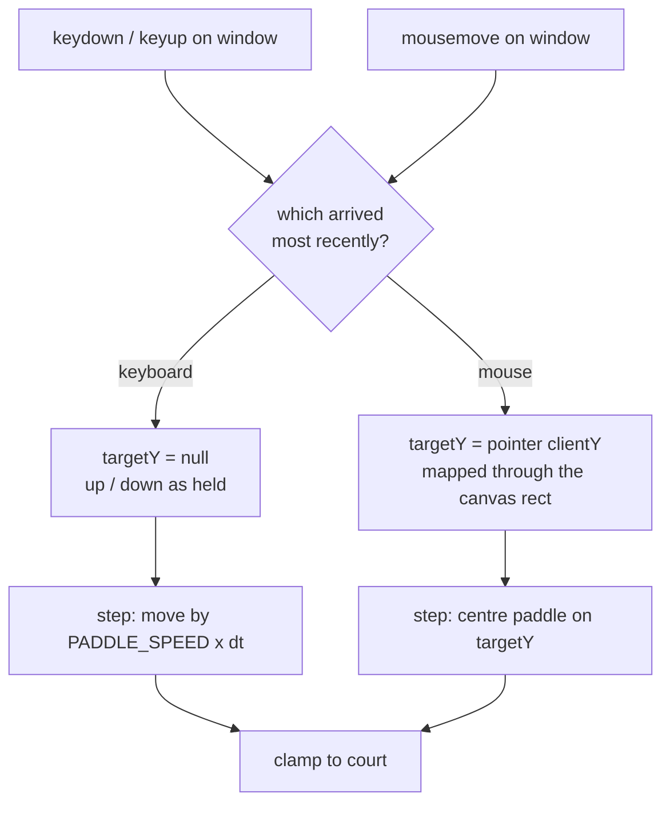
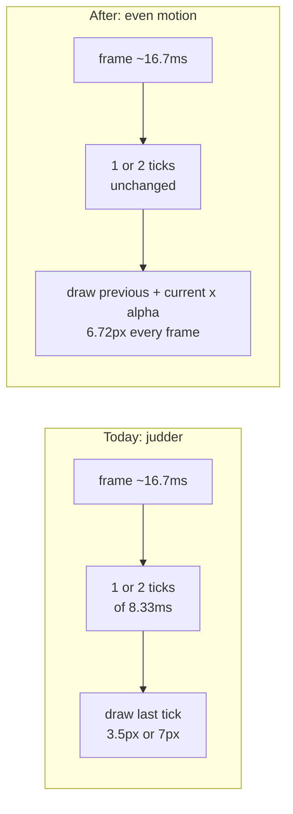

# Plan: Mouse paddle control, and smooth keyboard movement

- **Slug:** mouse-and-smooth-paddle
- **Branch:** feature/mouse-and-smooth-paddle
- **Status:** adjudicated

## Intent

Two complaints about how the player's paddle is driven, in the user's words:
"the mouse should also work for the paddles even outside the canvas" and "the
use of up and down arrows are not smooth".

The first is new capability: today there is no mouse handling at all, and the
Pong work item excluded it deliberately. The paddle should follow the pointer,
and it should keep following it when the pointer leaves the canvas — moving the
mouse above the court should pin the paddle to the top, not strand it wherever
it was.

The second is a defect in movement that already ships. Held-arrow movement
visibly judders rather than gliding, and the fix belongs with the mouse work
because both are about how the paddle is driven and both land in the same two
files.

## Acceptance criteria

- [ ] AC1: When the mouse moves over the court, the player's paddle centres
      itself on the pointer's vertical position, and continues to track it as
      the pointer moves. The computer's paddle is unaffected.
- [ ] AC2: When the mouse moves **outside** the canvas but still inside the
      page, the paddle keeps tracking the pointer's vertical position — above
      the top of the court it rests against the top edge, below the bottom
      against the bottom edge, and it never leaves the court.
- [ ] AC3: When the canvas is displayed at a size other than its intrinsic
      800×480 — the page is responsive, so a narrower window scales it — the
      paddle still lands under the pointer rather than at a proportionally
      wrong height.
- [ ] AC4: When the player moves the mouse and then holds a movement key, the
      keyboard takes over and the paddle moves at its own speed; when they then
      move the mouse again, the mouse takes over. The most recent input wins,
      and a stationary mouse never fights a held key.
- [ ] AC5: When a movement key is held, the paddle advances by the same distance
      on every rendered frame: the distance moved between one frame and the next
      never varies by more than one pixel for as long as the key is held. (Today
      it alternates between roughly 3.5 px and 7 px on alternate frames, which is
      the juddering being reported.)
- [ ] AC6: When the player clicks the court, the game starts and sound is
      available, exactly as pressing a key does — so the game is playable with
      the mouse alone. Merely moving the mouse does not start the game and
      produces no sound.
- [ ] AC7: When the page is loaded twice with `?seed=1` and driven with the same
      inputs, the rally is identical, as it was before this change. The
      simulation stays deterministic and frame-rate independent.
- [ ] AC8: When the game is running, the ball and the computer's paddle also move
      evenly frame to frame, with no visible stutter introduced or left behind by
      the smoothing work.

## Non-goals

- Touch and pen input. This is mouse only; `pointerdown`/`pointermove` from a
  finger or stylus stays out of scope, as does gamepad support.
- Pointer lock, hiding the cursor, or capturing the mouse.
- Any rebalancing to compensate for the mouse making the game easier — no ball
  speed-up, no change to `CPU_SPEED`, no difficulty setting. Snapping to the
  pointer does make the player stronger; that is accepted.
- A sensitivity setting, an invert option, or a control to turn mouse tracking
  off.
- Changing the audio, the scoring, the collision rules, or anything else settled
  by the `single-player-pong` work item.
- Reworking the fixed-timestep simulation itself. The tick rate and
  `PADDLE_SPEED` stay as they are; only what is *drawn* between ticks changes.

## Open questions

None. The one fork that would have changed the shape of the work — whether the
paddle snaps to the pointer or chases it at the keyboard's 420 px/s — was put to
the user before this plan was written. **Snap** was chosen: the paddle centre
goes where the pointer is, which is classic Pong mouse feel and is inherently
smooth because the mouse supplies the motion. The user accepted that this makes
the game easier, which is why the rebalancing non-goal above is explicit.

Two smaller decisions were made here rather than escalated, and are called out so
a reviewer can disagree with them:

- **Last input wins** (AC4) rather than the mouse permanently overriding the
  keyboard. A player who reaches for the arrows should not have to move the
  mouse to get control back.
- **Click starts the game** (AC6). Without it a mouse-only player cannot start,
  and a `mousemove` is not a user gesture a browser will unlock audio from — a
  click is.

## Approach

The change is confined to `src/input.ts`, `src/main.ts`, `src/game/step.ts`, and
a small addition to `index.html`'s hint line. It splits along the line the Pong
item already established: pure simulation with no browser dependencies, thin
adapters that talk to the browser.

**Mouse tracking** joins the existing keyboard adapter in `src/input.ts`, which
already listens on `window` rather than on the canvas — so tracking the pointer
outside the canvas (AC2) follows the pattern rather than fighting it. The
listener is `mousemove`, not `pointermove`, so touch and pen stay out per the
non-goal.

The pointer's `clientY` is mapped to a court coordinate through the canvas's
`getBoundingClientRect()`, scaling by `COURT_HEIGHT / rect.height`. The page is
responsive (`canvas { width: 100%; height: auto }`), so the canvas is only
rarely at its intrinsic 800×480, and a raw `clientY - rect.top` would be wrong
at every other width — that is AC3. This mapping is extracted as a pure function
so it can be unit tested without a browser.

**The simulation** learns about absolute positioning. `Input` gains a
`targetY: number | null`: when it is set, the paddle centre goes there, clamped
to the court; when it is null, the existing `up`/`down` velocity movement
applies unchanged. `step` stays pure, and the arbitration between the two
(AC4) lives in the input adapter, which is the only thing that knows which
arrived most recently.

**The judder** (AC5) has a specific cause. `main.ts` advances the simulation in
fixed 8.333 ms ticks inside an animation frame of roughly 16.667 ms, and draws
whatever the last tick produced. Two ticks do not divide evenly into a frame
once real vsync jitter is involved, so the loop runs one tick on some frames and
two on others — the paddle travels 3.5 px, then 7 px, then 3.5 px. The fix is
the standard one: keep the previous state alongside the current one and render
at `previous + (current - previous) × alpha`, where
`alpha = accumulator / FIXED_DT_MS`. The simulation is untouched, so AC7 holds:
what changes is only what is drawn between two ticks that already happened.

Interpolation is applied to the whole state uniformly rather than picking
entities, so there is one code path. For a mouse-driven paddle that means at
most one frame of smoothing — about 16 ms, below perception — which is accepted
in exchange for not having two rendering rules.

**Claims** — assertions about this repository that the approach rests on. Each
could be false:

- [ ] C1: `src/input.ts` handles keyboard only today and already attaches its
      listeners to `window`, so a window-level `mousemove` listener fits the
      existing structure and needs no change to how `main.ts` wires input.
- [ ] C2: `canvas { width: 100%; height: auto }` in `src/style.css` means the
      canvas is CSS-scaled away from its intrinsic 800×480 at most window
      widths, so any mapping that ignores `getBoundingClientRect()` is wrong in
      normal use rather than in an edge case.
- [ ] C3: `main.ts` renders with no interpolation, at `FIXED_DT_MS = 1000/120`,
      so the number of ticks per animation frame alternates between one and two
      — including under Playwright's faked 16 ms clock, where the accumulator
      sequence makes it structural rather than a symptom of vsync jitter.
- [ ] C4: The exact-position assertions in the existing suite are taken either at
      rest (`CENTRED_PADDLE`) or against a clamped edge (`{top: 0, bottom: 79}`),
      where interpolation makes no difference; the ball assertions are ranges.
      So the smoothing should not require an existing assertion to be loosened.
      **If it does, that is a finding, not a licence** — weakening a test to fit
      is what `/quorum:guard` exists to catch.
- [ ] C5: Playwright's `page.mouse.move` dispatches events that reach a
      `window`-level `mousemove` listener, at coordinates outside the canvas but
      inside the viewport, so AC2 is testable through the real event path.
- [ ] C6: A `mousemove` is not a user gesture a browser will start an
      `AudioContext` from, so AC6's click is load-bearing rather than a
      convenience.





## Steps

- [x] S1: Extend `Input` with `targetY: number | null` and teach `step` to centre
      the player's paddle on it when set, clamped to the court, leaving `up`/
      `down` behaviour untouched when it is null. Unit test both paths.
- [x] S2: Add the pure client-to-court mapping function and unit test it against
      a scaled rect, an unscaled rect, and positions above and below the canvas.
- [x] S3: Add `mousemove` tracking on `window` to `src/input.ts` and the
      last-input-wins arbitration between mouse and keyboard (AC1, AC2, AC4).
- [x] S4: Add click-to-start, sharing the existing `onStart` path so audio
      unlocks on the same gesture (AC6).
- [x] S5: Keep the previous state in `main.ts` and render interpolated by
      `alpha` (AC5, AC8), leaving the fixed-step simulation as it is (AC7).
- [x] S6: Update the on-screen hint and `README.md` to say the mouse works and
      that a click starts the game.
- [x] S7: Behavioural tests for every acceptance criterion, each verified to fail
      when the behaviour it guards is broken.

## Test strategy

**Behavioural tests (Playwright)** carry the acceptance criteria, driven through
the real event path — `page.mouse.move` for AC1–AC4, real key presses for AC4
and AC5, a real click for AC6 — with the same two boundary substitutions the
Pong item established: the recording `AudioContext` and Playwright's clock. The
paddle is read back off the canvas with the existing `paddleAt` helper, so what
is asserted is what a player sees.

AC3 is tested by setting a viewport narrow enough to scale the canvas, then
checking the paddle lands under the pointer — the assertion has to be in court
coordinates derived from the observed rect, not a hardcoded number, or it would
merely re-implement the bug.

AC5 is the interesting one: hold a key, sample the paddle's top on every frame
with `recordFrames`, and assert no two consecutive frame deltas differ by more
than a pixel. Against today's code that fails immediately, because the deltas
alternate between roughly 3.5 px and 7 px — which is what makes it a real test
rather than a restatement.

**Unit tests (Vitest)** cover the two pure additions only: the client-to-court
mapping, and `step`'s handling of `targetY` including clamping at both edges.
These exist because both are total functions with many input cases and no I/O.

No production code gains a hook that exists only for tests, and no existing
assertion is loosened to accommodate the smoothing — see C4.

## Build notes

Built on `feature/mouse-and-smooth-paddle`. Suite green: 38 unit (Vitest), 25
behavioural (Playwright). Every new test was checked by breaking the behaviour
it guards and watching it fail — the list of breaks is at the end of these
notes.

### PLAN DEFECT: C4 is false — an existing exact assertion did have to move

> C4: The exact-position assertions in the existing suite are taken either at
> rest (`CENTRED_PADDLE`) or against a clamped edge (`{top: 0, bottom: 79}`),
> where interpolation makes no difference [...] **If it does, that is a finding,
> not a licence.**

It is a finding. `tests/e2e/court.spec.ts`, *AC2: a movement key let go after
Shift does not stay stuck down*, failed as soon as the court was drawn between
two ticks:

```
- Expected  - 1   (released, sampled the instant the key came up)
+ Received  + 1   (the same paddle 60 frames later)
    "top": 1,  ->  "top": 0,
```

The cause is inherent to interpolation, not a bug in it. The baseline
`released` is read on the frame the key is let go, and on that frame the drawn
paddle is still `(1 - alpha)` of a tick behind the simulation — here 0.28 px,
enough to move the thresholded pixel reading by one row. Sixty frames later the
simulation has stopped, previous and current agree, and the paddle is drawn
exactly where it is. The plan accepted this lag explicitly ("at most one frame
of smoothing — about 16 ms, below perception"); what it did not foresee is a
test sampling inside that frame.

**What I did**, deliberately choosing the smallest change that is not a
weakening: I inserted `await runFrames(page, 2);` between the key release and
the baseline sample, so the baseline is taken after the render has settled. The
assertion itself is untouched — still `toEqual`, still exact, still over 60
frames. Nothing that a stuck key would do is any less visible than it was
before: in both the old and the new version the paddle has reached the top of
the court by then, so a stuck `w` would leave it at 0 either way.

**What I think should happen.** Two things for the reviewers and the judge:

1. Confirm the edit is not a weakening. It is the one existing test this change
   touched, and C4 said touching one is a finding.
2. That test is weaker than it reads, and was before this change: after 30
   frames of held `W` the paddle is against the top of the court, so
   "the paddle stays where it was let go" is comparing 0 with 0. A stuck key
   would not be caught by that assertion at all — only by the `ArrowDown` check
   that follows it. Worth a follow-up to hold the key for fewer frames so the
   paddle is still in open court when it is let go. I did not do it here: it is
   a change to a test I was not asked to touch, beyond what this plan bounds.

### PLAN DEFECT: C1 is partly false — wiring input did change

> C1: [...] a window-level `mousemove` listener fits the existing structure and
> needs no change to how `main.ts` wires input.

The listener does fit; the wiring did change. Mapping the pointer needs the
canvas's `getBoundingClientRect()`, so the adapter has to be given the canvas.
`main.ts` now keeps the element it was previously throwing away:

```ts
const court = element<HTMLCanvasElement>('court');
const context = courtContext(court);
...
const controls = createControls(window, court, { onStart: start, onToggleMute: toggleMute });
```

The alternative — having `input.ts` look the canvas up by its DOM id — would
have put knowledge of the page's markup in the input adapter, which is worse.
One extra argument seemed the smaller price. No acceptance criterion is
affected.

### Judge's correction to the S5 deviation note (added at adjudication)

The S5 deviation note below is kept as it was written, but two of its claims are
wrong and the guard it describes has since been narrowed. Recorded here so a
maintainer reading it is not misled:

- "It only shows on frames that run a single tick, which is why seed 1 [...]
  happens to hide it" is **false**. Replaying the loop against the compiled
  `step` for seeds 1-10, every first point lands on a **two-tick** frame. The
  three numbers the note quotes reproduce exactly (seeds 2, 7, 9 -> x = 351.3,
  124.8, 156.7), but on two-tick frames. Seed 1 smears just as badly (x = 108.8);
  it is not used for the guard test because its first point lands at frame 433,
  outside the 90-frame recording window, whereas seed 7 loses one at frame 70.
  The guard is needed whenever a phase change lands on the final tick of a frame.
- Snapping the **whole** state across a phase change was too wide. Nothing moves
  either paddle but its own travel, so snapping them lent the paddle most of a
  tick on that frame and took it back on the next -- 8.82 px then 4.62 px against
  a steady 6.72, which is a 4.20 px variation where AC5 allows 1. `interpolate`
  now snaps the ball alone and keeps both paddles interpolated, and
  `tests/e2e/smoothness.spec.ts` gained an AC5 case at seed 9 that holds a key
  across a scored point. See `docs/work/mouse-and-smooth-paddle/verdict.md`.

### Deviations

- **S3 deviation:** renamed `createKeyboard` → `createControls`, `Keyboard` →
  `Controls`, `KeyboardHandlers` → `ControlHandlers`. The plan describes the
  mouse "joining the existing keyboard adapter", and leaving a function called
  `createKeyboard` reading mouse events would have been the misleading kind of
  small diff. `Controls` rather than `Input` because `Input` is already the
  per-tick value the adapter returns. Two files touched, no behaviour change.
- **S4 deviation:** `onStart` changed from `(event: KeyboardEvent) => void` to
  `() => void`. A click has no `KeyboardEvent` to pass, and the one caller
  (`start()` in `main.ts`) already ignored the argument.
- **S5 deviation:** `interpolate` does **not** blend across a phase change — if
  `previous.phase !== current.phase` it draws `current` outright. The plan says
  interpolation is "applied to the whole state uniformly", which is about which
  entities move, and this is about when two states describe motion at all. A
  phase change is a cut: the ball is picked up off the edge of the court and put
  back on the centre spot, and blending across it draws the ball half way up the
  court on the frame a point is scored. It is not theoretical — with the guard
  removed, seeds 2, 7 and 9 all flash the ball at x = 351, 124 and 156
  respectively on their first scoring frame. It only shows on frames that run a
  single tick, which is why seed 1 (the seed most of the suite uses) happens to
  hide it. There is now a test for it, at seed 7.
- **S5 note:** `interpolate` lives in `src/render.ts` rather than `main.ts`. The
  plan did not say where. It is a pure function about what is drawn, and
  `render.ts` is the module that exists for that.
- **S1 note:** `Input.targetY` is required, not optional, so every producer has
  to be explicit. That made one existing unit-test call site name it:
  `{ up: true, down: false }` → `{ ...NO_INPUT, up: true }` in
  `tests/unit/step.test.ts`. Same value, same assertions.
- **S7 deviation:** `tests/e2e/support/pong.ts` gained more than the plan
  implies. `Sample` now carries `player` and `cpu` paddle spans — read out of
  the canvas image the sampler was already taking, at the same column and
  threshold `paddleAt` uses, so no extra work per frame — which is what lets
  `recordFrames` carry AC5 and AC8 as the test strategy describes. Also added:
  `courtBox` (the canvas's box on screen, which AC3 has to derive its
  expectation from), and `frameSteps` / `unevenness` as the shared reading of
  "did this move by the same amount every frame".

### Things a reviewer should look at, that are not deviations

- **The paddle does not follow the pointer until the game has started.** `step`
  returns early in `idle` and `game-over`, so a mousemove before the first click
  or key press sets `targetY` but moves nothing. That is required by the
  `single-player-pong` item's AC1 ("draws a still, silent court until the player
  starts"), and this plan's non-goals put that item's settled behaviour out of
  scope, so I left it. It does mean AC1 here reads slightly wider than what
  ships. AC6 tests the idle case explicitly: a mousemove changes no pixel.
- **`getBoundingClientRect()` includes the canvas's 1 px border.** The court is
  drawn inside the border, so the mapping is out by up to about one court pixel
  (at 1280 wide the box is 480.8 tall for a 478.8 px court). The plan names
  `getBoundingClientRect()` explicitly and one pixel in 480 is not visible, so I
  did not add border arithmetic. The AC1/AC3 tests allow a 1 px miss for this
  reason.
- **The status line still says "Press any key to start"** even though a click
  now does too. S6 named the hint line and `README.md`; both mention the mouse
  and the click. Changing `statusText` would have meant editing assertions in
  `court.spec.ts`, `scoring.spec.ts` and `tests/unit/status.test.ts`, which is
  not what the plan asked for. Worth a follow-up.
- **Auto-repeat is deliberately not a fresh press.** A held movement key claims
  the paddle back off the mouse on its `keydown`, but not on the repeats that
  follow, or a key held while the mouse moves would snatch the paddle back
  thirty times a second and the two would fight. This is the mechanism behind
  AC4's "a stationary mouse never fights a held key".
- **AC7 is carried by a new test as well as the old one.** `replay.spec.ts` is
  untouched and still proves a keyboard-driven rally replays exactly; the new
  `mouse.spec.ts` AC7 test drives click, mouse and key at one seed twice and
  compares ball, both paddles and every sound.

### The claims, as they turned out

- **C1 — partly false.** See the plan defect above. The listener fits; the
  wiring changed.
- **C2 — true.** `courtBox` reports 480.8 px tall at a 1280 px window and 281.6
  at a 520 px one. The canvas is never at 1:1.
- **C3 — true.** Under Playwright's 16 ms clock the accumulator runs two ticks
  on twelve frames out of thirteen and one on the other, structurally. Drawing
  the last tick outright makes AC5 and AC8 fail immediately.
- **C4 — FALSE.** See the plan defect above.
- **C5 — true.** `page.mouse.move` at x = 5, outside the canvas, drives the
  paddle through the window-level listener.
- **C6 — true as far as this repository can show it.** The click is load-bearing
  here: `audio.play` is a no-op until `unlock` has run, so with the click
  listener removed AC6 fails with no sound at all. Whether a *real* browser
  would refuse to start an `AudioContext` from a `mousemove` is not something
  the recording context can prove, and I did not test it.

### Breaks used to check the new tests

Each was applied to the source, run, and reverted.

| Break | Fails |
|---|---|
| draw the last tick outright (`alpha = 1`) | AC5, AC8 (even motion) |
| drop the phase guard from `interpolate` | AC8 (smearing, seed 7) |
| feed the interpolated state back into `state` | AC4 |
| remove the `mousemove` listener | AC1 ×2, AC2, AC3, AC4, AC6 |
| `targetY` never leaves the adapter | AC1 ×2, AC2, AC3, AC4, AC6 |
| map with `clientY - box.top` | AC3, and 3 `courtY` unit tests |
| drop `clampPaddle` from the named-position branch | AC1 (computer), AC2, 1 unit test |
| `step` ignores `targetY` | 5 unit tests |
| remove the click listener | AC6 |
| start the game on `mousemove` | AC6 |
| serve from `Math.random()` | AC7 |

