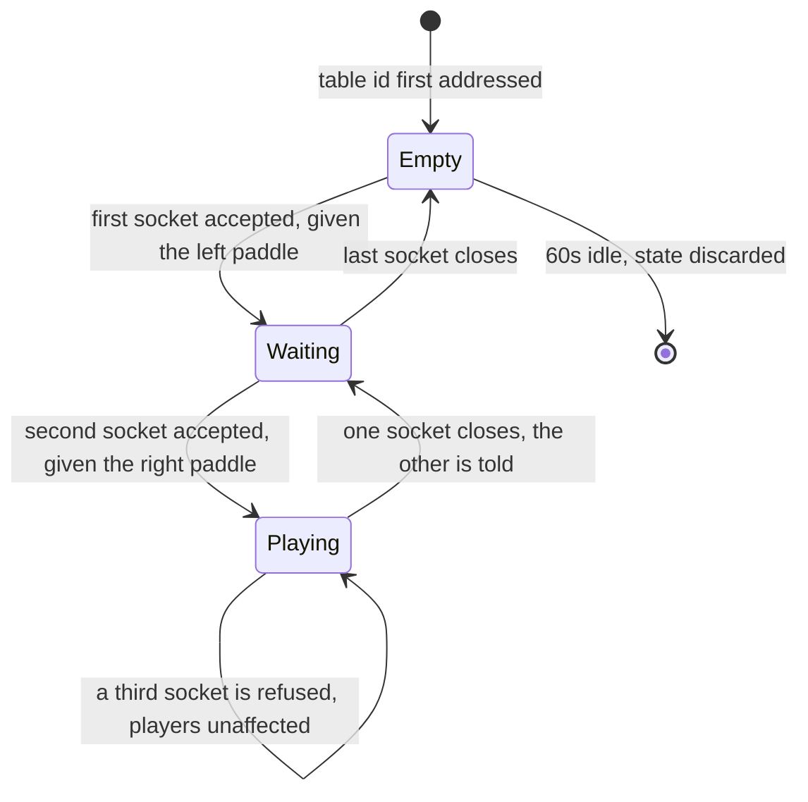
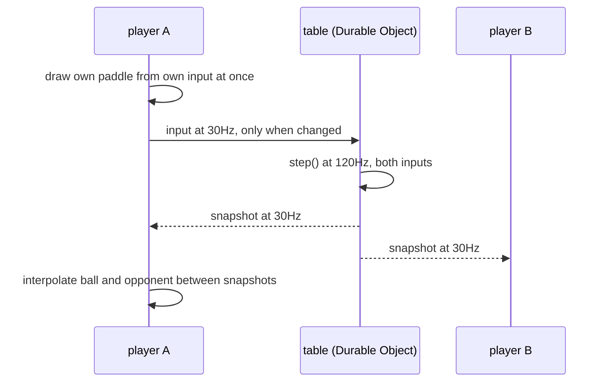

# Plan: Two people, one table id, one game of Pong

- **Slug:** multi-player
- **Branch:** feature/multi-player
- **Status:** approved

## Intent

In the user's words: *"I want to convert this to optionally multiplayer. When a
user comes to the site, they can either choose single player mode which works the
way it currently does, or they can enter a table-id which is just a string. The
way it works is that 2 people agree on a table id such as "Johnny-13224" or
something like that. They would need to pick something that would be sufficiently
hard for colliding with others. But if multiple couples pick a common table id
that collides -- so be it. The first 2 players that arrive and select the same
table id play together and others are locked out while the 2 are playing."*

Two constraints follow from that and are not negotiable by the build. **Single
player must keep working exactly as it does today** — same CPU, same seeded
replay, same feel — because it is the mode that already works. And **collisions
are accepted, not solved**: no matchmaking, no id generation, no uniqueness
guarantee. A table id is a rendezvous string, and two strangers colliding on one
is a consequence the user has already agreed to.

The transport was delegated — *"Seems like it should use websockets or something,
you choose"* — and the trust model settled with it: the server owns the game.

## Acceptance criteria

- [ ] AC1: When the page loads, the player is offered a choice between single
      player and joining a table by typing an id. Neither is entered by default —
      the game does not start until one is chosen.
- [ ] AC2: Single player is unchanged. `?seed=1` driven the same way replays the
      identical rally it does today, the computer's paddle still moves at 160 px/s
      against the player's 420, and every existing test in `tests/e2e/` and
      `tests/unit/` passes with no assertion weakened.
- [ ] AC3: When two browsers enter the same table id, both land in one game: the
      first to arrive drives the left paddle, the second the right, each is told
      which side is theirs, and both show the same score throughout.
- [ ] AC4: When a third browser enters a table id two players already hold, it is
      refused with a message that says the table is in use, and the two already
      playing see no interruption — their rally continues and their score is
      unaffected.
- [ ] AC5: When a player moves their own paddle, it responds on the next rendered
      frame without waiting for a server round trip. Measured with 200 ms of
      artificial latency, the player's own paddle still tracks their pointer
      within one pixel while the opponent's lags.
- [ ] AC6: When one of the two players disconnects, the other is told the
      opponent has left within five seconds, and the table is freed: a new
      browser entering that same id is admitted rather than refused.
- [ ] AC7: When a table has had no connections for its idle timeout, it is freed —
      entering that id afterwards starts a fresh game with the score at 0-0
      rather than resuming the abandoned one.
- [ ] AC8: The score and the ball are the server's. A client that mutates its own
      copy of the game state — score, ball position or the opponent's paddle —
      has that change overwritten by the next server broadcast, and the other
      browser never observes it.
- [ ] AC9: Single player works with no table server reachable at all. With every
      request to the server blocked, choosing single player still starts a game
      and plays to a point being scored.

## Non-goals

- **Matchmaking of any kind** — no lobby, no id generation, no collision
  detection, no "this id is taken, try this one". The user ruled this out
  explicitly: *"if multiple couples pick a common table id that collides -- so
  be it."*
- **Reconnecting to a game in progress.** A dropped player frees the table (AC6);
  they do not get a rejoin token or a grace period. This was chosen deliberately
  over the stricter reading of "while the 2 are playing".
- **Spectators.** A third arrival is refused (AC4), not shown the rally.
- **Rollback or reconciliation.** Local echo is for the player's own paddle only
  (AC5). The ball and the opponent are rendered from server snapshots, and a
  disagreement is resolved by the server simply being right.
- Accounts, persistence, results history, or anything surviving a table's life.
- Voice, chat, emotes, or any communication beyond the game.
- Changing the rules, the physics, the sounds, or the court.
- Any change to the touch, mouse, keyboard or landscape work already shipped,
  beyond passing an input to a new place.

## Open questions

None. Four forks were put to the user and settled before this was written:

- *Architecture?* Server-authoritative simulation in a Cloudflare Durable Object.
- *What frees a table?* Disconnect, or an idle timeout. A third arrival is
  refused with a message.
- *Scope?* One run covering the whole thing. The alternative — landing the
  simulation refactor on its own first — was offered and declined.
- *Branch?* `feature/multi-player`, matching the directory already holding
  `prompt.md`.

Three things were decided rather than asked, being implementation detail:
the idle timeout is **60 seconds**; the server simulates at the existing 120 Hz
and broadcasts at **30 Hz**; the client sends input at **30 Hz**, and only when
it has changed.

## Approach

### The refactor is the load-bearing part, not the socket

`step(state, dtMs, input)` takes one `Input` and calls `cpuVelocity` for the
right-hand paddle inside itself. Two humans means the right paddle needs an input
too — but a human `Input` and the computer are not interchangeable. A held key
moves a paddle at `PADDLE_SPEED` (420 px/s); the computer moves at `CPU_SPEED`
(160). Handing the computer an `Input` would silently make it two and a half
times faster and break AC2's promise that single player is unchanged.

So the signature becomes `step(state, dtMs, left, right)` where `right` is
`Input | null`, and **`null` means the computer plays that side** — the existing
`cpuVelocity` path, untouched, at its own speed. Single player passes `null` and
is bit-for-bit what it is today; multiplayer passes the opponent's input.

### The Durable Object is the table

One Durable Object instance per table id, addressed by
`idFromName(tableId)` — so the id *is* the rendezvous, with no registry to keep.
The object holds the authoritative `GameState`, accepts at most two WebSocket
connections, and runs the same fixed-timestep loop `main.ts` runs today.

Refusal (AC4) happens before the socket is accepted, so a third arrival costs the
two playing nothing.

### Who owns what on screen

The player's own paddle is drawn from their own input immediately (AC5), because
a paddle is a pure function of `targetY` and both sides compute it identically —
so local echo and the server agree except during loss, and the server's snapshot
silently wins when they do not. Everything else — ball, score, opponent — comes
from the server (AC8) and is rendered through the existing `interpolate`, which
already blends two `GameState`s and does not care that they are now snapshots
rather than consecutive ticks.

### Where the code goes

- `src/game/step.ts` — the two-input signature. The only change to the simulation.
- `src/net/table.ts` (new) — the browser's socket client: connect, send input,
  receive snapshots, report connection state.
- `src/session.ts` (new) — which mode is running and what the connection is
  doing, kept out of `GameState` so the simulation stays a pure value.
- `src/main.ts` — chooses between the local loop and the networked one.
- `index.html`, `src/style.css`, `src/status.ts` — the mode choice and the
  messages for waiting, refused, and opponent-left.
- `worker/` (new) — the Durable Object and its `wrangler.toml`, importing
  `src/game/` directly so the server and client cannot drift.

### Deployment changes shape

Today `npm run deploy` pushes static assets to Cloudflare Pages and nothing else.
A Durable Object cannot live in that; it needs a Worker. The site stays on Pages
at its current URL and a second deploy publishes the Worker, with the client
reading the socket URL from a Vite env var so a local `wrangler dev` can be
pointed at during development.

**Claims** — C1, C2, C4, C5 and C6 were read off this repository; C3 is the one
that could stop the whole approach.

- [x] C1: `step()` in `src/game/step.ts` takes a single `Input` and calls
      `cpuVelocity`/`cpuTargetY` internally for `cpuY`. No caller passes a second
      input today.
- [x] C2: `PADDLE_SPEED` is 420 and `CPU_SPEED` is 160, so the computer cannot be
      driven through the human `Input` path without changing how it plays.
- [x] C3: **Durable Objects are available on this Cloudflare account.** Workers
      are — the account holds KV namespaces for another project — but DO
      entitlement was not verified, and every other claim here assumes it. If it
      is false the transport must change and the plan needs revisiting, which is
      why it is first in the build order.
- [x] C4: There is no `wrangler.toml` in the repository; `npm run deploy` is
      `wrangler pages deploy dist --project-name=pong` with CLI flags only, so
      Worker config is new rather than an edit.
- [x] C5: `playwright.config.ts` runs one `webServer` (`npm run build && npm run
      preview`) with `reuseExistingServer: false`, and two projects. Networked
      tests need a second server process alongside it.
- [x] C6: `interpolate(previous, current, alpha)` in `src/render.ts` takes two
      whole `GameState`s and is already used for between-tick rendering, so it
      serves between-snapshot rendering with no change.

## Steps

- [x] S1: **Verify C3 first.** Stand up a trivial Durable Object and confirm it
      deploys and accepts a WebSocket on this account. If it does not, stop and
      report rather than building on it.
- [x] S2: Change `step()` to `(state, dtMs, left, right)` with `right: Input |
      null`; update `main.ts` to pass `null`. Confirm the existing suite is green
      and `?seed=1` replays identically — AC2 before anything else is added.
- [x] S3: Add unit-testable table logic: slot assignment (first left, second
      right, third refused) as a pure function, so AC3 and AC4 have a test that
      does not need a network.
- [x] S4: Write the Durable Object — two sockets, the fixed-timestep loop, 30 Hz
      snapshots, refusal, disconnect and the 60 s idle timeout.
- [x] S5: Write `src/net/table.ts` and `src/session.ts`; wire `main.ts` to run
      either the local loop or the networked one.
- [x] S6: Add the mode choice to `index.html` and the new status messages.
- [x] S7: Local echo for the player's own paddle (AC5).
- [x] S8: Add `wrangler dev` to the Playwright `webServer` list and write the
      two-context networked tests.
- [x] S9: Add the Worker deploy to `npm run deploy` and document both URLs.
- [x] S10: Run the full suite in both projects and again in the CI Linux image.

## Test strategy

This work item breaks an assumption the whole existing harness rests on: that a
test drives one page with a frozen clock. Two browsers and a server cannot share
a frozen clock, so the networked tests use real time and assert on convergence
rather than on exact frames.

- **AC2 and AC9 keep the existing shape** — one page, frozen clock, the tests
  that already exist. AC2 is the regression wall: it runs before any network code
  and must never go red afterwards. AC9 blocks the socket URL via Playwright
  routing and asserts a point is still scored.
- **AC3, AC4, AC6, AC7** — two (or three) `browser.newContext()` pages against a
  `wrangler dev` started by Playwright's `webServer`, asserting on what each page
  shows: which side it was given, the same score on both, the refusal message,
  the opponent-left message, a fresh 0-0 after a timeout. Poll with `expect`'s
  built-in retry rather than fixed sleeps.
- **AC5** — Playwright route interception delaying the socket, asserting the
  player's own paddle still tracks within a pixel while the opponent's does not.
- **AC8** — mutate the client's state from the page and assert the next broadcast
  overwrites it, and that the second browser never saw it.
- **Unit** — the two-input `step()` (including that `null` still gives the CPU its
  own speed), and the pure slot-assignment function from S3.
- **Timing.** Networked tests are the flakiest thing in this repository by some
  distance. Every one must pass ten consecutive runs before it is considered
  done, and any fixed sleep is a defect.

**Run it on Linux.** The `mobile-touch-controls` work item shipped a real defect
that six review lenses, the judge and the recheck all missed because every one of
them ran on macOS. Anything concluded here about browser or socket behaviour must
be confirmed in the CI image.

## Build notes

- **S1 / C3 confirmed.** A throwaway Worker (`pong-do-probe`) carrying one
  SQLite-backed Durable Object was deployed to this account, answered a real
  WebSocket handshake with `101` and echoed a frame back, and was then deleted.
  Durable Objects are entitled here, so the rest of the plan stands.
- **S2 done, AC2 wall green.** `step` now takes `(state, dtMs, left, right)`.
  `right` is declared `Input | null = null`: the plan's signature, with a default
  so that every existing call site — the twenty-odd `step(state, TICK_MS,
  NO_INPUT)` calls in `tests/unit/step.test.ts` above all — keeps compiling
  untouched. That is deliberate. AC2's promise is that the existing tests pass
  with nothing weakened, and a test file that was not edited at all is the
  strongest form of that evidence. `main.ts` still passes `null` explicitly, as
  the plan asks. Suite after the change: 41 unit, 44 e2e, all green.
- **S2 addition:** `movePaddle(y, input, dt)` is exported from `step.ts`. The
  plan did not name it, but the client has to draw its own paddle from its own
  input before the server has seen it (AC5) and the two only agree if they move
  a paddle by the same rule. One rule, two callers.
- **S3 done.** `worker/slots.ts` holds `assignSlot(taken)` — left, then right, then
  `null` — with `tests/unit/slots.test.ts` covering first/second/third and a slot
  handed back after its holder leaves. No network involved.
- **S3 addition:** `src/net/protocol.ts`. The plan named `src/net/table.ts` and
  `worker/` but nothing that both compile; the message shapes had to live
  somewhere both ends import or they drift, and `src/net/table.ts` cannot be it
  because it is browser socket code. It also carries the parsers, which matter
  more than they look: the server is holding the score for two people, and
  `{"targetY": 1e999}` is a paddle stranded at infinity for the rest of the
  game. `tests/unit/protocol.test.ts` covers the rejections.
- **S4 done.** `worker/table.ts` is the Durable Object: two seats, the same
  fixed-timestep loop over the same imported `step()`, 30 Hz snapshots, refusal,
  disconnect and the idle timeout. Verified against a real `wrangler dev` over
  real sockets: first socket left, second right, third refused with
  `{"kind":"refused"}` and close code 4409, a disconnect freeing the seat with
  the score intact (1-1 resumed by the next arrival), and — with the timeout
  turned down — a table returning 0-0 and `idle` after it expired, where a
  reconnection inside the timeout still found 1-1.
- **S4 deviation — refusal is sent, not withheld.** The plan has the third
  arrival refused *before* the socket is accepted. A browser cannot see that:
  a WebSocket handshake that fails carries no status and no body to the page,
  only an anonymous error, and AC4 asks for a message that says the table is in
  use. So the table accepts the socket, sends `{kind:'refused'}`, and closes it
  with code 4409. The plan's actual concern is met in full — the refusal touches
  only the refused socket, and the two playing are neither written to nor
  stepped differently.
- **S4 decision — a disconnect keeps the game, only the timeout discards it.**
  The plan's state diagram frees a *seat* on disconnect (`Playing --> Waiting`)
  and discards state only at `Empty --> [*]: 60s idle`, so that is what was
  built: a player leaving stops the ball where it is and the next arrival picks
  the game up, score and all. It is also what makes AC7 mean anything — if a
  disconnect reset the score, "a fresh game rather than the abandoned one" would
  be true for reasons that have nothing to do with the timeout.
- **S4 decision — the ball moves only while both paddles are held.** Simulating
  against an unattended paddle would run the score up on somebody who has left.
  The court is still broadcast while waiting, so the player who is there sees
  the score and a still court rather than a blank canvas.

### The AC1 / AC2 collision, and how it was settled

**PLAN DEFECT — the plan does not say how AC1 and AC2 can both be true.**

AC1 wants a page that has entered neither game until the player chooses. AC2
wants every existing test in `tests/e2e/` to pass with nothing weakened. Every
one of those tests does `page.goto('/?seed=1')` and immediately presses a key,
a finger or the mouse and expects a game underway. Put a chooser in front of
them and all forty-four go red; take the choice out and AC1 is unmet. The plan
names both criteria and never reconciles them, and it is not something the build
could leave to a later step: the choice is the first thing on the page.

What was built: **a URL that already names a game is a choice already made.**

- `?seed=<n>` — single player. A seed names a replay of the game the computer
  plays; the server holds the generator at a table, so a seed can only mean the
  one-player game.
- `?table=<id>` — that table, directly. It also makes a table id something two
  people can send each other rather than only say out loud, which is worth
  having on its own.
- neither — the page asks (AC1).

Every existing spec carries `?seed=`, so all forty-four are untouched — not one
assertion, one URL or one line of setup was changed — and AC1 is tested on a
bare `/` in `tests/e2e/choose.spec.ts`. The chooser is `hidden` in the markup and
unhidden only when nothing was named, so it is not merely invisible to those
tests, it is not in their layout at all, which is what keeps the landscape
measurements exact.

This reading was chosen rather than asked because there was nobody to ask, and
because the alternative — editing the `goto` line of eight spec files — trades a
plain rule for a diff across the whole regression wall on the one work item whose
first promise is that the wall does not move. **The judge should put it to the
user**: if a player arriving at `/?seed=1` ought to be asked which game they want
rather than dropped into single player, this is the decision to revisit, and the
cost of revisiting it is exactly those eight `goto` lines.

## Build notes (continued)

- **S5 done.** `src/net/table.ts` is the browser's end of a socket — connect,
  report input at 30 Hz and only when it changed, and turn what comes back into
  four things the game cares about. `src/session.ts` holds the mode, the table
  id, which paddle is this player's and how the connection is doing, out of
  `GameState` as the plan asks. `main.ts` now starts one of two loops, guarded so
  it can only ever start one.
- **S6 done.** The chooser is in `index.html`, hidden until the page knows there
  is a question. `src/status.ts` gained `tableStatusText` and `sessionStatusText`
  alongside the untouched `statusText` — the existing unit test calls
  `statusText(state)` with one argument and still does.
- **S6 addition — the scoreboard says which paddle is yours.** AC3 asks that each
  player is told which side is theirs, and the status line cannot be it: it is
  empty while the ball is in play, which is most of the game. The two names on
  the scoreboard become `You` and `Opponent`, mirroring the court, and they are
  there for the whole game. The waiting message names the paddle in words as
  well.
- **S7 done.** The player's own paddle is drawn from their own input every frame
  through the same `movePaddle` the server uses. While nothing is being asked for
  — no key, no pointer — the server's value is taken instead, so a held key's
  echo cannot drift away from the server for good.
- **S8 done.** `playwright.config.ts` now starts two servers: the built page, and
  a real `wrangler dev` running the real Durable Object. `tests/e2e/table.spec.ts`
  covers AC3, AC4, AC5, AC6, AC7 and AC8 across two and three browser contexts;
  `tests/e2e/choose.spec.ts` covers AC1 and AC9.
- **S8 deviation — the suite's tables idle out in three seconds, not sixty.**
  Production keeps the minute the plan settled; `wrangler dev` is started with
  `--var IDLE_TIMEOUT_MS:3000` so AC7 can watch a table expire without costing
  the suite a minute per run. The mechanism under test is the same one; only the
  constant differs, and it is passed in exactly the way a real deployment would
  override it.
- **S8 note — the test harness never reaches into the client.** AC8 needs the
  page's own copy of the state mutated, and exposing a hook for that would put
  test-only API into the shipped bundle. Instead the tests wrap
  `window.WebSocket` before the page loads: the same wrapper counts connection
  attempts (AC9), delays traffic in both directions (AC5) and dispatches a
  message the server never sent (AC8). The page under test is unmodified.
- **S8 — two flakes found and fixed, not tolerated.** The first ten-times run had
  two failures in a hundred and ten. AC7 was racing its own idle timeout: opening
  a fresh browser context took longer than the table survived, so "come straight
  back and find the same game" sometimes came back to a timed-out one. The
  context is now opened before the table empties, so returning is a page load.
  AC4 then failed because a failed test does not reach its own `close()` calls
  and Playwright does not close a context the test made itself — the leaked
  contexts piled up across repeats until the browser started dropping sockets,
  which reads exactly like a player leaving a table. An `afterEach` now closes
  everything a test opened. After both fixes: 110 of 110, and 60 of 60 again at
  eight workers.
- **S9 done.** `npm run deploy` is now `deploy:table` then `deploy:site` — the
  table server first, so a page never goes out promising a game that cannot be
  joined. `.env.production` carries `VITE_TABLE_URL`, and the README documents
  both URLs, the two-deploy shape and how to point a build at a local
  `wrangler dev`.
- **S9 deliberately left out: the production deploy itself was not run.** S9 asks
  for the deploy to be *added* and the URLs documented, which is what was done.
  Publishing is the pipeline's last step and the user's call, not a build step's.
  The Worker at `pong-table.joelstevick.workers.dev` therefore does not exist yet;
  `npm run deploy:table` creates it.

## Build notes — things the plan did not foresee

- **PLAN DEFECT — adding a Worker forces the repository's Node baseline from 20
  to 22.** `.nvmrc` said `20` and CI reads it. Every `wrangler` release that is
  free of the current npm advisories (the fix landed in 4.114.0) declares
  `engines.node >= 22`, and the versions that still run on Node 20 pull in the
  vulnerable `esbuild`, `undici`, `ws` and `sharp` — dev-only, but a repository
  that reports zero advisories today would start reporting six. `.nvmrc` is now
  `22`; `npm audit` reports zero. This is a real change to the project's
  supported Node version and the judge should surface it: it was not in the plan,
  it affects CI and every contributor, and the alternative was accepting the
  advisories.
- **New devDependencies:** `wrangler` (the table server has to be built, run in
  the test suite and deployed reproducibly — `npx` fetching it at CI time is not
  that) and `@cloudflare/workers-types`. `npm run build` now typechecks the
  worker too, under `worker/tsconfig.json`, which has the Workers runtime types
  and no DOM.
- **A stray `Uncaught Error: Network connection lost.` appears in the
  `wrangler dev` log** when a browser context is closed abruptly mid-broadcast.
  It is the local runtime's, not the table's — `send` now checks `readyState`
  first and the whole tick is wrapped so one dead socket cannot take a table
  down with it — and the tests show the surviving player unaffected. Worth a
  look in production logs after the first real deploy.
- **Not built, deliberately, because no criterion asks for it:** an `Origin`
  check on the table socket, any rate limit on connections, and a rejoin token.
  The first two are the kind of hardening a public Worker eventually wants; the
  third is an explicit non-goal.

## Build notes — S10, and how hard the suite was leaned on

- **macOS, both projects:** 74 unit and 55 behavioural, green, and green on four
  consecutive full runs afterwards.
- **The CI Linux image:** the whole thing again inside
  `mcr.microsoft.com/playwright:v1.62.1-noble` from a clean `npm ci` — build,
  unit, and both Playwright projects — 55 passed. The plan asked for this
  explicitly because `mobile-touch-controls` shipped a defect every macOS reviewer
  missed. One caveat to be honest about: that image carries Node 24, while
  `.nvmrc` (and therefore CI) says 22. What it proves is Linux and a modern Node,
  not Node 22 exactly.
- **Ten consecutive runs of every networked test**, as the plan's test strategy
  requires: 110 of 110 on macOS and 110 of 110 on Linux, at four workers. There
  is no fixed sleep anywhere in the two-browser assertions; every wait is a poll
  on what a page shows. The two `setTimeout`s that remain are not waits for
  something to happen — one is the rally being watched in AC3, one is the idle
  period AC7 exists to measure.
- **One failure seen once and not since, recorded rather than buried.** In a
  single full-suite run, AC7's last browser reported `Lost the connection` — a
  socket that never opened against the local `wrangler dev`, not a table
  misbehaving. It has not recurred in four full runs and two hundred and twenty
  repeat runs across both platforms. Two things came out of it: the assertion
  was strengthened, because polling the score alone would have *passed* for a
  browser that never got in (the page ships 0-0 in its own markup), so it now
  waits for the welcome first; and the test shim now records each socket's close
  code, so if it happens again the failure says whether the table refused the
  browser or the connection simply broke. If a reviewer sees this again, that is
  where to look.
