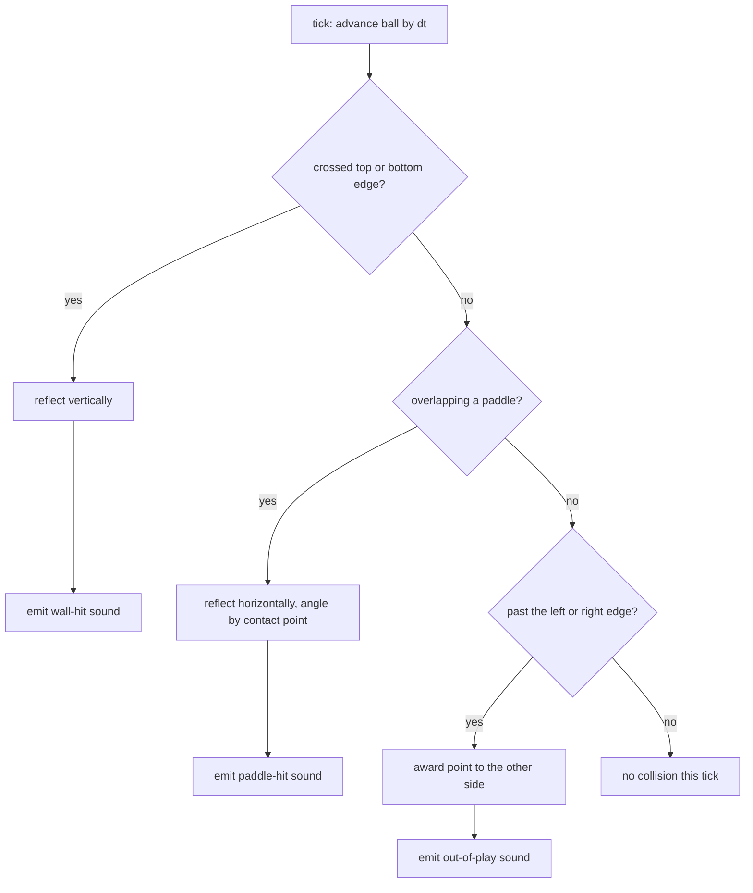
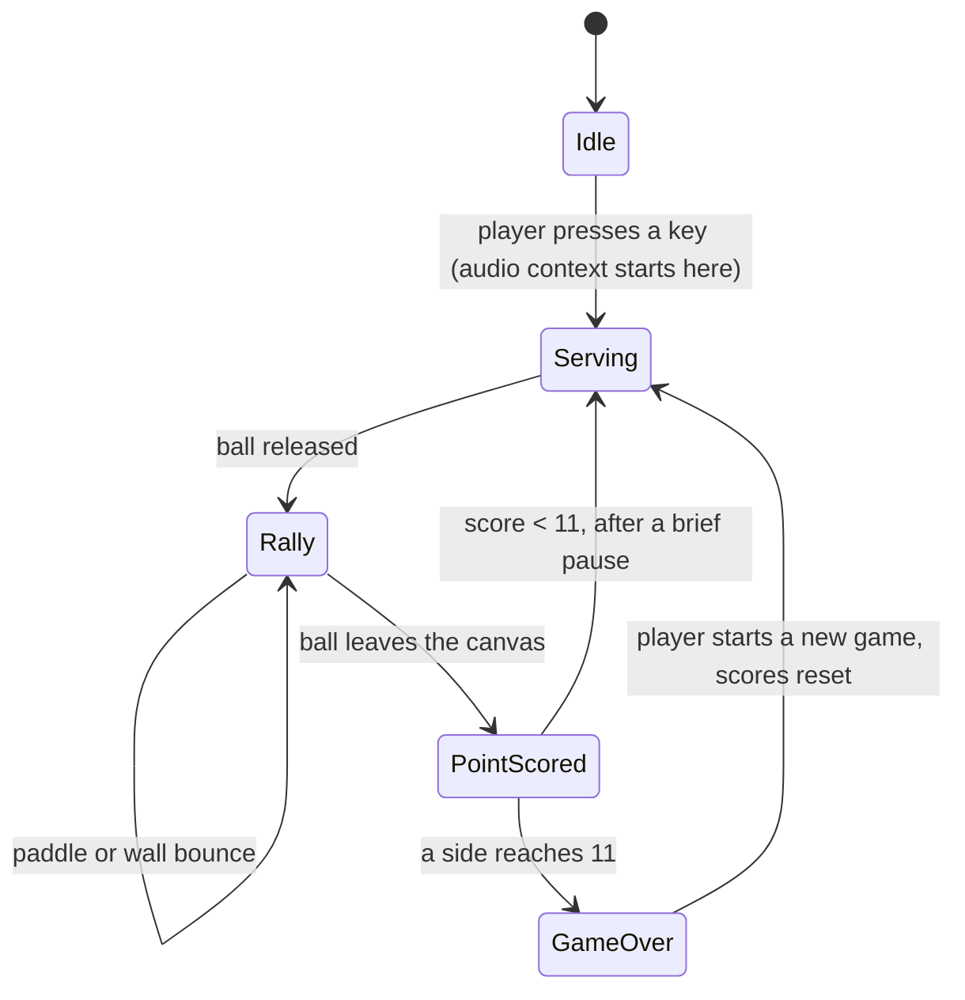

# Plan: Single-player Pong with distinct collision sounds

- **Slug:** single-player-pong
- **Branch:** feature/single-player-pong
- **Status:** built

## Intent

Build a playable single-player Pong game: the player controls one paddle, the
computer plays the other, and the ball rallies between them. The distinguishing
requirement is audio — the game must make **different sounds for paddle strikes,
wall strikes, and when the ball leaves the canvas**, so the three events are
audibly distinguishable from one another without looking at the screen. The
repository is empty, so this work item also establishes the stack (Vite +
TypeScript), the run/build commands, and the test harness that later work items
will follow.

## Acceptance criteria

- [ ] AC1: When the page loads, a Pong court is drawn on a canvas showing a
      player paddle on the left, a computer paddle on the right, a ball at
      centre, and a score of `0` – `0`. Nothing moves and no sound plays until
      the player starts the game.
- [ ] AC2: When the player presses a key to start, the ball is served and the
      rally begins; holding `ArrowUp`/`W` moves the player paddle up and
      `ArrowDown`/`S` moves it down, and the paddle never leaves the top or
      bottom edge of the court however long the key is held.
- [ ] AC3: When the ball approaches the computer's side, the computer paddle
      moves toward the ball and returns it — with `?seed=1` the computer returns
      the first serve rather than letting it pass.
- [ ] AC4: When the ball strikes either paddle, a paddle sound plays and its
      direction of travel reverses horizontally. No wall sound and no
      out-of-play sound occur at that moment.
- [ ] AC5: When the ball strikes the top or bottom wall, a wall sound plays that
      is audibly different from the paddle sound — a different pitch and a
      different duration — and the ball's vertical direction reverses.
- [ ] AC6: When the ball leaves the canvas past either paddle, a third,
      out-of-play sound plays that differs from both the paddle sound and the
      wall sound in pitch, timbre, and duration.
- [ ] AC7: When the ball leaves past the player's paddle the computer's score
      increases by one; when it leaves past the computer's paddle the player's
      score increases by one. In both cases the displayed score updates and a
      fresh ball is served after a brief pause.
- [ ] AC8: When either side reaches 11 points, play stops, the winner is
      announced on screen, and the player can start a new game that resets both
      scores to `0`.
- [ ] AC9: When the mute control is activated, no further sound is produced by
      any of the three events while play continues normally; activating it again
      restores sound.
- [ ] AC10: Loading the page with `?seed=1` twice produces an identical first
      serve — the same ball direction and the same first collision — so a rally
      can be reproduced exactly.

## Non-goals

- Two-player, local or networked multiplayer.
- Touch, pointer, or gamepad control. Keyboard only.
- Background music, volume slider, or any audio setting beyond the mute toggle
  in AC9.
- Persisted high scores, accounts, or any server-side component.
- Selectable difficulty levels. One computer skill level, tuned to be beatable.
- Sprite art, animation polish, or a title/menu screen beyond the start prompt
  and the game-over announcement.
- Deploying or hosting the game anywhere.

## Open questions

None. The four decisions that would have changed the shape of the work — branch
name, what "single player" means, the stack, and where the sounds come from —
were settled with the user before this plan was written.

## Approach

A Vite + TypeScript app with no framework. `index.html` hosts a single
`<canvas>` plus a live-updating score region; `src/main.ts` wires the modules
together and owns the `requestAnimationFrame` loop.

The code splits along the line that makes it testable: **pure simulation** with
no browser dependencies, and **thin adapters** that talk to the browser.

- `src/game/state.ts` — the game state shape and its lifecycle (see the state
  diagram below).
- `src/game/step.ts` — a pure function `step(state, dtMs, input) -> {state, events}`.
  It advances the ball, resolves collisions, moves both paddles, and returns the
  list of events that occurred this tick (`paddle-hit`, `wall-hit`,
  `out-of-play`, `point-scored`, `game-over`). It touches no globals and no
  clock, which is what lets the collision rules be unit tested directly.
- `src/game/cpu.ts` — a pure function returning the computer paddle's target
  velocity from the ball's position. It tracks the ball at a capped speed
  slightly below the ball's, with a small dead zone, so it is beatable. No
  randomness.
- `src/game/rng.ts` — a seeded generator (mulberry32) used only for serve angle
  and direction. The seed comes from `?seed=<n>` when present, otherwise from
  the current time. This is what makes AC10 checkable and rallies reproducible.
- `src/audio.ts` — the only module that touches Web Audio. It maps each event
  kind to one synthesized tone and is the single place a sound is produced.
- `src/render.ts` — draws the state to the 2D context; reads state, writes
  nothing.
- `src/input.ts` — keyboard listeners producing the `input` value the step
  function consumes.

**Sound design.** Three synthesized tones, deliberately separated on pitch,
waveform, and length so they are distinguishable by ear and by assertion:

| Event | Waveform | Frequency | Duration |
|---|---|---|---|
| paddle strike | square | 459 Hz | ~90 ms |
| wall strike | square | 226 Hz | ~16 ms |
| ball leaves canvas | sawtooth | 490 Hz sliding down to 120 Hz | ~300 ms |

Browsers refuse to start an `AudioContext` before a user gesture, so the context
is created (or resumed) on the keypress that starts the game — which is why AC1
requires silence until then, and why that requirement is real behaviour rather
than a testing convenience.

**How the sounds get tested.** Playwright cannot hear audio, and the plan does
not add test-only hooks to production code to work around that. Instead the test
replaces `window.AudioContext` before the app loads with a recording double, and
asserts on what the game asked the browser to play — the same shape as asserting
on outbound HTTP requests. Determinism comes from Playwright's clock control
(which drives `requestAnimationFrame`) plus the `?seed=` parameter, so a test can
run the rally forward a fixed number of frames and get the same collisions every
time.

**Claims** — assertions about this repository and its environment that the
approach rests on:

- [ ] C1: The repository is empty of source — no `package.json`, no build config,
      no existing test setup — so nothing here has to match an existing pattern
      and no existing convention is being broken.
- [ ] C2: Node v20.16.0 and npm 10.9.0 are installed and are new enough for the
      current Vite and Playwright releases.
- [ ] C3: No Playwright browsers are currently installed on this machine
      (`~/.cache/ms-playwright` is absent), so the build step must run
      `npx playwright install chromium` before any behavioural test can pass.
- [ ] C4: Playwright's `page.clock` API controls `requestAnimationFrame` as well
      as timers, so the game loop can be advanced deterministically frame by
      frame without the game exposing a stepping hook.
- [ ] C5: `page.addInitScript` runs before the application's own scripts, so
      replacing `window.AudioContext` there is sufficient to capture every sound
      the game produces.
- [ ] C6: A `<canvas>`-based game has no accessible text for the score, so the
      score must be rendered in the DOM (not painted into the canvas) for AC7 to
      be assertable through the user-facing surface — and for a screen reader to
      announce it at all.

## Steps

- [x] S1: Scaffold the project — `package.json`, Vite + TypeScript config,
      `index.html` with the canvas and a DOM score region, and `npm run dev` /
      `build` / `preview` scripts. Commit a working blank court.
- [x] S2: Implement `rng.ts` and `state.ts`: the state shape, the seeded serve,
      and reading `?seed=` from the URL.
- [x] S3: Implement `step.ts` — ball motion, wall reflection, paddle reflection
      with contact-point angling, out-of-play detection, and the event list.
      Unit test the collision rules here (AC4, AC5, AC6 geometry; AC10).
- [x] S4: Implement `input.ts` and player paddle movement with edge clamping
      (AC2), and `render.ts` drawing the court, paddles, and ball (AC1).
- [x] S5: Implement `cpu.ts` and wire the computer paddle into the loop (AC3).
- [x] S6: Implement `audio.ts` — the three synthesized tones, the gesture-gated
      context, and the mute toggle (AC4, AC5, AC6, AC9) — and connect the step
      function's events to it.
- [x] S7: Implement scoring, the serve pause, the 11-point win, the winner
      announcement, and restart (AC7, AC8).
- [x] S8: Add the Playwright harness — the `AudioContext` recording double, the
      clock control, and behavioural tests covering every acceptance criterion.
      Verify each test fails when the behaviour it guards is broken.
- [x] S9: Write `README.md` with the run, build, and test commands, and note the
      `?seed=` parameter.

## Test strategy

**Behavioural tests (Playwright, against the built app served by `vite preview`)**
carry the acceptance criteria. Every AC gets at least one test. The browser is
driven the way a player drives it — real key presses, real page load — with two
boundary substitutions: `window.AudioContext` replaced by a recorder via
`addInitScript`, and the clock installed via `page.clock` so frames advance
deterministically. Sound assertions check the recorded waveform, frequency, and
duration, which is how AC4, AC5 and AC6 prove the three sounds are *different*
rather than merely present. The score is read from the DOM, not the canvas.

**Unit tests (Vitest)** cover the pure simulation only: reflection geometry and
contact-point angling in `step.ts`, the computer's tracking function in
`cpu.ts`, and the seeded generator's reproducibility in `rng.ts`. These exist
because collision maths has many input cases and no I/O — not because the
modules exist.

Nothing inside the boundary is mocked, no test reaches into private state, and
no production code gains a hook that exists only for tests.

## Build notes

- **S1/S2 sequencing:** the plan asks S1 to commit "a working blank court"
  before `state.ts` and `render.ts` exist. Rather than write throwaway drawing
  code, the first commit carries the scaffold together with S2's `state.ts` and
  S4's `render.ts`, which is what draws the idle court. No behaviour differs;
  only the commit boundary moved.
- **S3/S5 sequencing:** `step.ts` moves both paddles, so it imports `cpu.ts`.
  `cpu.ts` (S5) therefore landed with S3 rather than after S4.
- **C3 correction:** the claim says Playwright browsers live at
  `~/.cache/ms-playwright`. On macOS the cache is
  `~/Library/Caches/ms-playwright`. The substance of the claim held — no browser
  was installed, and `npx playwright install chromium` was required and run.
- **S5 deviation — the computer paddle's top speed.** The plan specifies "a
  capped speed slightly below the ball's". Built that way (280 px/s against the
  ball's 380) the computer is *unbeatable*, which contradicts the plan's own
  non-goal ("one computer skill level, tuned to be beatable") and would make the
  player's half of AC7, and AC8's winner, unreachable. The geometry is the
  reason: the paddle starts tracking from the centre line with the whole half
  court of warning, so at 280 px/s it reaches any arrival point before the ball
  does, and rallies never end. Simulating the built `step` function over a range
  of speeds (idle player, ball-tracking player, aiming player, several seeds)
  put the boundary well below "slightly": at 280, 240 and 200 px/s a tracking
  player could not score in 90 s of play; at 160 px/s the computer still returns
  the serve and beats a passive player 11–0, and a player who aims off-centre
  scores regularly. `CPU_SPEED` is therefore 160 px/s. The tracking rule the
  plan describes — current ball position, dead zone, no randomness — is
  unchanged.
- **S8 addition — the faked clock has to be paused, not just installed.**
  `page.clock.install()` leaves the clock running at the speed of the real one,
  so frames kept arriving between one assertion and the next: the number of
  frames a page had seen depended on how long it took to load and how long each
  assertion took. AC10 failed intermittently on that drift — the same rally,
  sampled at different moments. The tests now install the clock at a fixed
  instant and immediately `pauseAt` it (`installClock` in
  `tests/e2e/support/pong.ts`), so time moves only when a test asks it to. Four
  consecutive full runs after the change were identical. Production code is
  unaffected. This is worth knowing for any later work item that uses the clock.
- **S8 addition — `@types/node`.** `npm run build` typechecks
  `playwright.config.ts`, which reads `process.env`, so `@types/node` is a dev
  dependency and `node` is in the tsconfig `types` list.
- **S8 — every behavioural test verified by breaking what it guards.** Each
  mutation was applied to production code, the guarding test run, and the change
  reverted:

  | AC | Break | Result |
  |---|---|---|
  | AC1 | a new game starts in `serving`, not `idle` | fails |
  | AC2 | paddle clamping removed | fails |
  | AC3 | `cpuVelocity` always returns 0 | fails |
  | AC4 | paddle tone given the wall tone's pitch and length | fails |
  | AC5 | wall tone given the paddle tone's pitch and length | fails |
  | AC6 | out-of-play tone changed from sawtooth to square | fails |
  | AC7 | scoring increments by 0 | fails (both tests) |
  | AC8 | `WINNING_SCORE` raised to 99 | fails |
  | AC9 | `play()` ignores the mute flag | fails |
  | AC10 | `readSeed` ignores `?seed=` | fails |

- **Mute is both a button and the `M` key.** The plan names a "mute control"
  without saying what it is. AC9 is driven from the keyboard, in keeping with
  the keyboard-only non-goal; the button exists so the control is visible and
  reachable, carries `aria-pressed`, and blurs itself after a click so the next
  key press does not re-activate it. `M` does not also start the game.
- **AC1 needed the court drawn at load.** With the clock paused, nothing is
  drawn until a frame runs, and AC1 is about what the page shows *on load*.
  `main.ts` therefore renders once before starting the animation loop, which is
  what a player sees too — a blank canvas until the first frame is a real, if
  brief, flaw.
- **Left out deliberately:** no rally speed-up, no CI workflow, no deployment,
  and no `.claude/skills/run-regression-tests/SKILL.md` recipe file — none are
  in the plan, the middle two are explicit non-goals, and the README already
  carries the commands (S9).
