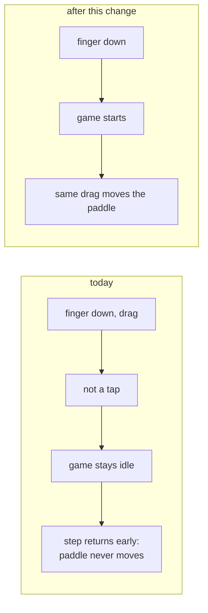

# Plan: Start a game with your finger, and send someone the table

- **Slug:** start-and-share
- **Branch:** feature/start-and-share
- **Status:** adjudicated

## Intent

Two problems, both in the same moment: a person arriving on a phone, trying to
start playing, and trying to get somebody else in.

**A drag does not start the game, so the first thing a player does is
discarded.** Reported from a real phone: *"I will put my finger down and try to
push it and nothing happens. I will let my finger up and try to push it again
and it works just fine."* Reproduced against the live site — a drag on an idle
court leaves the status line unchanged and the paddle at 200, and only a
separate tap starts anything. The cause is a rule that was right for a mouse and
wrong for a finger: `mobile-touch-controls` AC6 said *"Dragging a finger without
tapping does not start the game"*, mirroring a mouse, where moving does not start
a game and clicking does. On a phone, dragging the paddle **is** the natural
first action, so the rule throws away exactly the gesture a player makes first.
It bites again after every game over. Meanwhile the idle line still reads *"Press
any key to start"* on a device with no keys.

**And a table cannot be sent to anybody.** The chooser offers a text field and a
Join button; the `?table=<id>` URL that would let one person send the game to
another already works and is surfaced nowhere. So the only way in is reading a
string down the phone.

**This supersedes two shipped decisions, deliberately.** `mobile-touch-controls`
AC6 required that a drag not start the game and produce no sound — AC1 below
reverses both halves for touch. And `multi-player`'s Non-goals ruled out id
generation, which was right when the only interface was a text field and stops
being right once the page can hand you a link.

## Acceptance criteria

- [ ] AC1: When a finger touches the idle court and drags, the game starts on
      that touch **and** the paddle follows the finger through the same drag —
      no second gesture needed. Sound is available from it, as it is from a tap.
- [ ] AC2: The same holds after a game has been won: one touch starts the next
      game and moves the paddle, without lifting and touching again.
- [ ] AC3: The idle line does not tell a touch device to press a key. On a
      device with touch it names touching the court; where there is a keyboard it
      still says so.
- [ ] AC4: The mouse is unchanged. Moving the mouse over an idle court still
      does not start the game, and a click still does — the behaviour
      `mobile-touch-controls` AC6 protects for a pointer that has a button.
- [ ] AC5: The chooser offers a way to start a table without typing anything.
      Using it joins a table and the page shows a URL that joins the same table.
- [ ] AC6: A generated id can be read down a phone line: an adjective, an animal
      and a three-digit number joined by hyphens, like `mute-harrier-553`. The
      dictionaries give at least a hundred million distinct ids, every generated
      id is accepted by `normaliseTableId`, and two generated in a row differ.
- [ ] AC7: While a player waits at a table, the full joining URL is on screen and
      selectable, with a control that copies it.
- [ ] AC8: Opening that URL in a second browser joins the same table: the two are
      seated opposite each other and see the same score.
- [ ] AC9: Typing an id by hand behaves exactly as it does today, including
      joining a table that a generated link created.
- [ ] AC10: The copy control degrades rather than breaking. Where the clipboard
      is unavailable or refused, the URL is still shown, still selectable, and the
      page says copying is unavailable rather than silently doing nothing.
- [ ] AC11: Everything else already shipped still holds. The full existing suite
      passes with no test weakened, and the only assertions that change are the
      ones AC1 and AC2 supersede.

## Non-goals

- **Matchmaking.** No lobby, no "find me an opponent", no directory of tables. A
  table is still a rendezvous between two people who already know each other.
- **Reserving a generated id.** Minting one does not claim it; the first two
  sockets still take the table. Two generated ids colliding is possible and
  vanishingly unlikely, and the behaviour if it happens already exists.
- **QR codes**, deep links, custom domains, or shortening the URL.
- **Changing how the paddle tracks** once a game is running. AC1 is about the
  gesture that starts one, not about the tracking that already works.
- Rejoining, spectating, hibernation, or anything about the table server. This
  work item does not touch `worker/`.

## Open questions

None. Four decisions taken rather than asked:

- **A touch on the court starts the game on `pointerdown`.** Once a drag must
  start it, waiting for `pointerup` would leave the whole drag unplayed — the
  exact complaint. A tap still starts it, because a tap begins with a
  `pointerdown` too, which makes the tap-slop rule unnecessary for starting.
- **The generated id is words, not random characters.** Random characters made
  the typed field vestigial — nobody invents `k7m-q2x-9fp` — so the two ways in
  did not fit together. A sayable id makes them complementary: the link is for
  sending, the id is for reading aloud.
- **`unique-names-generator` rather than a hand-rolled list.** Measured before
  choosing: 1202 adjectives and 355 animals, MIT, typed, no dependencies of its
  own, and 7.1 KB gzipped once Vite has shaken the dictionaries this does not
  import. That takes the bundle from 5.5 KB to about 12.6 KB, which is a real
  increase and an irrelevant size. It also means the word list is somebody's
  curated corpus rather than one improvised here, which is the part a hand-rolled
  list gets wrong — any generator that combines words can land somewhere
  unfortunate.
- **This is the project's first runtime dependency.** Everything in
  `package.json` today is a devDependency. Worth stating rather than discovering.
- **Three digits on the end, not two words alone.** Adjective and animal alone is
  427 thousand ids; the digits take it to 384 million, cost nothing to say, and
  move the birthday bound from roughly seven hundred tables live at once to
  twenty-three thousand. This matters more than it did when players chose their
  own: a collision used to be theirs to shrug at, and a generated one is ours.
- **Sharing is progressive**: the platform share sheet where `navigator.share`
  exists, the clipboard where it does not, a selectable URL where neither works.
- **The link appears while waiting**, beside the message that already names the
  table — the moment the player needs it and is not busy playing.

## Approach

### Starting

`src/input.ts` already routes `pointerdown` on the court into a tap tracker, and
calls `onStart` from `pointerup` only when the finger travelled within
`TAP_SLOP`. For a non-mouse pointer that becomes: start on `pointerdown`. The
slop test stops gating the start; the mouse keeps its `click` path untouched,
which is what holds AC4.

Nothing about paddle tracking changes. Once the game is not idle, `step` moves
the paddle from `targetY` exactly as it does now — the drag was always being
tracked, it was the *simulation* that was not running.

`src/status.ts`'s idle line becomes a function of whether the device has touch,
which is the only place it can be decided — the string is shared by both modes.

### Sharing

`generateTableId()` goes in `src/net/protocol.ts` beside `normaliseTableId`,
since the two are the same concern and a generated id must satisfy the existing
validator (C4). The chooser in `index.html` gains a "Create a table" control. The
link renders where `tableStatusText` already names the table being waited at, and
copying is a small module with three tiers — the interesting part being what
happens when the first two are unavailable, since a copy button that silently
does nothing is worse than none.

**Claims** — C1 through C5 were read or measured against this repository and the
live site; C6 and C7 are about the platform.

- [ ] C1: On the deployed site, a touch drag on an idle court leaves `#status`
      reading "Press any key to start" and the paddle at 200; a subsequent tap
      starts the game and the next drag moves it. **Measured**, and it is the
      whole of the reported bug.
- [ ] C2: `src/input.ts` calls `handlers.onStart()` from `onPointerUp` only when
      `travelled <= TAP_SLOP`, and from `onClick` for the mouse.
- [ ] C3: `step` returns its argument unchanged while the phase is `idle`, which
      is why the paddle does not move rather than moving invisibly.
- [ ] C4: `normaliseTableId` trims and rejects empty or over
      `MAX_TABLE_ID_LENGTH` (64), so a generated id must satisfy it.
- [ ] C5: `index.html`'s `#choose` form holds `#play-single`, `#table-id` and
      `#play-table`, and nothing renders or offers a URL anywhere.
- [ ] C6: `unique-names-generator` 4.7.1 ships 1202 adjectives and 355 animals,
      is MIT, carries its own typings, has no dependencies, and costs 7.1 KB
      gzipped in a Vite build importing only those two dictionaries and
      `NumberDictionary` — against a current bundle of 5.5 KB. **Measured**, not
      estimated.
- [ ] C7: `navigator.clipboard.writeText` needs a secure context and can still be
      absent or refused, which is what AC10 exists for.
- [ ] C8: `navigator.share` needs a user gesture and is absent on most desktop
      browsers, so it is an enhancement rather than the mechanism.

## Steps

- [x] S1: Start the game from `pointerdown` for non-mouse pointers; leave the
      mouse's `click` path alone. Confirm AC1 and AC4 by hand against the built
      page before writing anything else.
- [x] S2: Make the idle status line touch-aware (AC3).
- [x] S3: Update the superseded assertions in `tests/e2e/touch.spec.ts`, saying
      in a comment which criterion superseded them and why, rather than editing
      an expectation silently.
- [x] S4: Behavioural tests for AC1, AC2 and AC4.
- [x] S5: add `unique-names-generator` as a dependency and write
      `generateTableId()` over `adjectives`, `animals` and a three-digit
      `NumberDictionary`, hyphen-separated. Unit tests for the shape, for the
      dictionary sizes reaching a hundred million, for `normaliseTableId`
      accepting what it makes, and for two in a row differing. **No empirical
      uniqueness run**: drawing a thousand ids and demanding no duplicate is a
      test whose own odds decide whether it passes, and it is the space that the
      criterion is about — assert that from the dictionary lengths, which is
      exact.
- [x] S6: The "Create a table" control, wired to mint and join.
- [x] S7: The share module, three tiers, unit-tested through injected fakes.
- [x] S8: Render the joining URL and its control while waiting.
- [x] S9: Behavioural tests for AC5, AC7, AC8, AC9, AC10.
- [x] S10: Update the hint text and README, which both describe agreeing an id as
      the only way in and pressing a key as the way to start.
- [x] S11: Full suite, both projects, and again in the CI Linux image.

## Test strategy

- **AC1, AC2, AC4** — behavioural, on the phone project, driving a real CDP touch
  drag on an idle court and asserting the paddle moved *within that same drag*.
  This is the criterion the bug report is about, so it must fail against today's
  code: verify by running it before S1 lands.
- **AC3** — assert the rendered line on a `hasTouch` context and on a desktop
  one, since it differs by device rather than by state.
- **AC5, AC7, AC8, AC9** — two contexts against a real `wrangler dev`: create a
  table in one, read the URL off the page, open it in the second, assert both are
  seated and agree. AC8 is the criterion that matters, because it is the thing a
  player will actually do.
- **AC6, AC10** — unit. The share tiers go through injected fakes rather than
  deleted globals, so the tiers are exercised rather than simulated. AC10 must
  assert the URL is present **and** that the page says copying is unavailable,
  verified by mutation — removing the message has to fail it.
- **AC11** — the existing suite, unmodified apart from the assertions S3
  supersedes, each annotated.

**Run it on Linux**, as every work item since `mobile-touch-controls` has.

## Build notes

Built on `feature/start-and-share`. Every new test was checked by breaking the
behaviour it guards and watching it fail; the breaks are recorded against the
step that added the test.

- **S1:** the tap tracker in `src/input.ts` is gone rather than relaxed.
  `TAP_SLOP`, the `tapping` state and the `pointerup`/`pointercancel` listeners
  existed only to decide whether a lifted finger had tapped, and with the start
  moved onto `pointerdown` there is nothing left for them to gate — a tap begins
  with a `pointerdown` too. `pointerdown` stays registered on the court alone, so
  a gesture that begins on the hint text still starts nothing, which is what
  keeps `mobile-touch-controls` AC5 green.
- **S1 — the sound half of AC1, measured rather than assumed.** The HTML spec's
  list of activation-triggering events names `pointerdown` only for
  `pointerType: "mouse"`, and `pointerup`/`touchend` for a finger, which would
  have made a drag start the game but not the audio. Chromium does not behave
  that way: driving a real CDP touch at a Pixel 5 context,
  `navigator.userActivation.isActive` and `.hasBeenActive` are both `true` inside
  the touch `pointerdown` handler and an `AudioContext` constructed there is
  `running`. So the start and the unlock ride the same event and no second call
  to `onStart` was added. The behavioural test asserts the sound reached the
  destination rather than trusting the measurement.
- **S1 confirmed by hand against the built page**, as the step asked, before any
  test was written. On a Pixel 5 context at `/?seed=1`: idle reads
  `Press any key to start` with the paddle at 200-279; after `touchStart` the
  line is empty and the paddle has not moved; after one `touchMove` with the
  finger still down the paddle is at 33-112. On Desktop Chrome, two `mousemove`s
  over the idle court leave `Press any key to start` and a click empties it.
- **S2 deviation — the game-over prompt was made touch-aware too.** AC3 names
  the idle line, and `statusText` says `Press any key` twice: once at `idle` and
  once after a win. Changing only the first would leave a phone reading
  `Computer wins! Press any key to play again` on a device with no keys, in the
  exact place the *Intent* says the bug "bites again after every game over" and
  where AC2 makes touching the court the way to play again. One
  `startGesture(touch)` now feeds both, so the two cannot drift. Nothing else
  about either line changed, and on a device with no touch both are byte for byte
  what they were.
- **S2:** `statusText` and `sessionStatusText` take the device as a parameter
  rather than reading it, so both answers stay unit-testable — the property that
  module's own comment is written around. `src/main.ts` reads it once at load as
  `navigator.maxTouchPoints > 0`. `'ontouchstart' in window` was measured and
  rejected: it is `false` on a Pixel 5 context, so it would have told exactly the
  device this exists for to press a key.
- **S2:** `tests/unit/status.test.ts` call sites gained the new argument, named
  `KEYBOARD` / `TOUCH` rather than passed as bare booleans. No case was removed
  or weakened; two were added for AC3.
- **S3:** the `AC6` test in `tests/e2e/touch.spec.ts` keeps its case and its
  number and now asserts the superseding behaviour, with a comment block naming
  `mobile-touch-controls` AC6, what it required, and why `start-and-share` AC1
  reverses it. Both halves are still checked: the drag on a fresh page, and then
  the tap on a second fresh page — a tap starting the game is not implied by a
  drag doing so, so the two are not folded into one.
- **S4:** three new tests on the phone (`start AC1`, `start AC2`, `start AC3`)
  and one on the desktop (`start AC4`), titled `start ACn` so they cannot be read
  as the `mobile-touch-controls` criteria they sit beside — the convention
  `landscape ACn` already set in that file. All four were watched failing:
  - `start AC1` and `start AC2` fail with `src/input.ts` reverted
    (`Expected: "" Received: "Computer wins! Touch the court to play again"` for
    AC2, which is the second bite the plan describes).
  - `start AC3` fails with `startGesture` pinned to `Press any key`
    (`Received: "Press any key to start"`).
  - `start AC4` fails when `onPointerDown` stops excluding the mouse — the
    button goes down on the idle court and the game starts, which is the
    regression AC4 exists to catch.

### Restarting at S5, and what was already in the tree

The build was stopped after S4 so AC6 could be amended, and relaunched from S5.
What it was relaunched onto was **not** a tree holding only S1–S4: the stopped
run had already written the whole of the sharing half — `generateTableId` over a
random-character alphabet, the Create button, `src/share.ts`, the invite row,
`tests/e2e/invite.spec.ts` and the README — against the AC6 that was replaced.
None of it was committed and none of S5–S10 was ticked, so this run treated it as
work in progress: the id generator was rewritten to the amended criterion, and
everything downstream of it was read, corrected where it named the old scheme,
and then verified against the criteria rather than taken on trust.

- **S5:** `generateTableId` is now `uniqueNamesGenerator` over `adjectives`,
  `animals` and a three-digit `NumberDictionary`, hyphen-separated —
  `mute-harrier-553`. The random-character alphabet, its rejection-sampling
  bound and its length constant are gone; nothing else referred to them.
  `unique-names-generator` 4.7.1 is in `dependencies`, the first runtime
  dependency this project has had, as the plan's *Open questions* said it would
  be.
- **S5 — the trap this is written around, found by reading the package rather
  than the docs.** `NumberDictionary.generate({ min, max })` does not return a
  dictionary of the numbers in that range; it returns a dictionary holding
  **one** number, drawn when it was called. Hoisting it to module scope — the
  obvious way to write this, and the way every example writes it — would put the
  same three digits on the end of every id a page ever minted, silently cutting
  the space from 384 million to 427 thousand. So `ID_DIGITS` is the config and
  the dictionary is drawn inside the function, and there is a test for exactly
  that, since the words would go on varying and no other assertion would notice.
- **S5 — C6 confirmed by measurement, not by reading the README of the package.**
  1202 adjectives and 355 animals, all distinct, all lowercase letters with no
  spaces or hyphens in any entry (so an id splits on `-` into exactly three
  parts). Longest possible id is 15 + 13 + 3 + 2 = 33 characters against
  `MAX_TABLE_ID_LENGTH` of 64. 1202 × 355 × 900 = **384,039,000**, against the
  hundred million AC6 asks for. The built bundle went from 5.5 KB gzipped to
  **12.82 KB**, which is the plan's measured 12.6 KB.
- **S5 — the worker bundle, checked because `src/net/protocol.ts` is compiled
  into the Durable Object too.** The plan puts `generateTableId` there (its
  *Approach*), and the module's own docstring says both ends import it — so a
  runtime dependency added there could have landed in the worker, which
  *Non-goals* says this work item does not touch. Measured both ways with
  `wrangler deploy --dry-run`: **21.93 KiB / 6.91 KiB gzipped with and without
  the dependency, byte for byte identical**, and no dictionary word or generator
  symbol anywhere in `table.js`. esbuild shakes it out, the package declares
  `sideEffects: false`, and `worker/` is untouched in substance as well as in
  the diff.
- **S5 tests — the four the plan asked for, plus one.** Shape (asserted against
  the corpora themselves, not a `\w+-\w+-\d{3}` pattern that a generator which
  had stopped using them would also satisfy), the size of the space, two in a
  row differing, and `normaliseTableId` accepting what it makes. The fifth is
  the hoisting trap above. **The thousand-generation no-duplicate test that the
  superseded AC6 carried is gone** — the plan says so explicitly and gives the
  reason: it is a test whose own odds decide whether it passes. Removing it is
  not a weakened assertion but the replacement of a probabilistic one with the
  exact arithmetic that supersedes it.
- **S5 mutations.** Separator `''` fails the shape test; a constant id fails
  "two in a row differ"; hoisting the number dictionary fails only the
  digits-afresh test; a separator long enough to breach the 64-character cap
  fails the `normaliseTableId` test. The space assertion is arithmetic over the
  corpus rather than over the implementation, so it has no mutation of its own:
  it fails if the corpus shrinks — `adjectives` cut to 300 gives 95,850,000,
  under the bar.
- **S6, S7, S8 were verified rather than rewritten.** Nothing in the Create
  button, the three share tiers or the invite row depended on the shape of an
  id; all three were read against the amended criteria and left as the stopped
  run wrote them. Only the sample ids in `tests/unit/share.test.ts` and
  `tests/unit/session.test.ts` changed, from `k7m3qphd2r` to `mute-harrier-553`,
  so a reader is not told two different things about what an id looks like.
- **S8 defect fixed, from the stopped run.** `tableLink` had been inserted
  between `readSession`'s doc comment and `readSession`, leaving that comment
  attached to the wrong function and `readSession` undocumented. `tableLink` and
  its own comment now sit above it. No behaviour changed.
- **S9 mutations**, since the invite tests were written before the stop and had
  never been watched failing. Each was run against the real `wrangler dev` and
  two browsers:
  - the invite row never shown while waiting → all seven fail;
  - the Create button joining a fixed id instead of a minted one → AC6 fails on
    the shape, and five others fail behind it because the second creator is
    refused at a table that is already full, which is itself the argument for
    generating the id;
  - `tableLink` emitting `?t=` instead of `?table=` → AC5, AC7, AC8 and AC9
    fail, and both AC10 tests pass, which is the separation those criteria are
    supposed to have;
  - `shareNote('unavailable')` returning `''` → only the AC10 no-clipboard test
    fails, which is the mutation AC10's own wording asks for.
- **S10:** the hint text was already rewritten by the stopped run and says
  nothing about the shape of an id, so it stands. The README's "Playing somebody
  else" section did name the ten-character alphabet, and now describes the words
  and says why they are words; the collision paragraph now quotes 1202 × 355 ×
  900 = 384 million rather than "about fifty bits". A paragraph the stopped run
  left over-long was rewrapped.
- **S11 — the Linux run caught a real regression that macOS did not, which is
  the whole reason the plan asks for it.** `landscape AC5: an iPhone SE draws
  the court exactly as it did`, shipped by `landscape-phone-layout`, failed 3/3
  in `mcr.microsoft.com/playwright:v1.55.0-noble` and passed every time on
  macOS. Measured rather than guessed, and bisected against `HEAD`: at 320×568
  the page's content ran 1 px past the screen —
  `documentElement.scrollHeight` 569 against an `innerHeight` of 568. The cause
  was the hint text. The stopped run's rewrite took it from 85 px tall to 136 px
  — three extra wrapped lines — against 50 px of slack under the court on that
  screen. Linux wraps it one line sooner than macOS does, so macOS had a pixel
  in hand and Linux did not.
- **S11 — fixed by shortening the hint, not by touching the layout or the
  test.** The hint still says both new things S10 requires of it (the drag
  starts the game on a phone; a table can be created and its link sent), in
  fewer words: 102 px, leaving 33 px of slack, measured in the same image at
  both portrait phones the test covers. Two alternatives were measured and
  rejected — the fuller phrasing "the drag that moves the paddle starts it too"
  leaves only 16 px, under one wrapped line, and shrinking `.hint` on portrait
  phones would change a layout `landscape-phone-layout` AC5 exists to hold
  still. "Tap or click the court" was deliberately kept word for word: the
  landscape announcement test asserts that phrase out of the accessibility tree,
  and no shipped assertion was edited to accommodate this build.
- **S11 result.** Green on both, twice over: macOS/Node 22, 129 unit and 76
  behavioural across both Playwright projects; and the whole thing again from a
  clean `npm ci` in `mcr.microsoft.com/playwright:v1.55.0-noble` (Node 22.18),
  129 unit and 76 behavioural. No test was weakened, skipped or deleted; the
  only assertions that changed anywhere are the `mobile-touch-controls` AC6 ones
  S3 supersedes, each annotated in place.
- **Claims.** C1 through C3 were confirmed by the S1–S4 run recorded above. C4
  re-read (`normaliseTableId` trims and rejects empty or over 64) and now
  asserted against a hundred generated ids rather than argued. C5 re-read: the
  `#choose` form held `#play-single`, `#table-id` and `#play-table`, and
  `#create-table` is the fourth. **C6 was re-measured for the amended AC6** and
  holds exactly: 4.7.1, MIT, no dependencies of its own, typings included, 1202
  adjectives and 355 animals, 12.82 KB gzipped against a previous 5.5 KB. C7 and
  C8 are about the platform and are what the three tiers exist for; both AC10
  tests exercise them — one with the clipboard and `navigator.share` removed
  before the page runs, one with the clipboard permission really granted and the
  link really read back off it.
