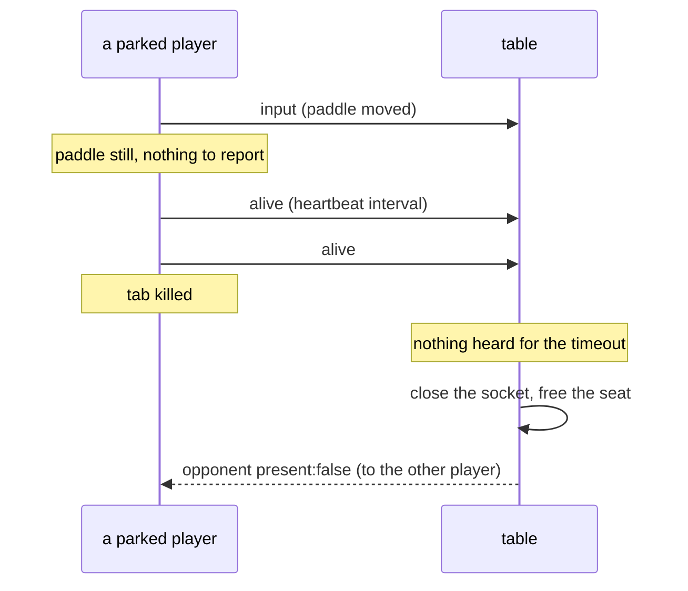

# Plan: Make the table server's limits hold, and keep them holding

- **Slug:** table-server-limits
- **Branch:** fix/table-server-limits
- **Status:** built

## Intent

The table server has limits on its door. Three things are wrong with them: one
does not work, one can be walked around, and nothing stops a future change from
quietly removing either.

- **A table nobody is playing at is never reclaimed.** The idle timer arms only
  when the *last* socket closes, so a seated socket that goes quiet — a closed
  laptop, a dropped network, a killed tab — holds a resident, duration-billed
  Durable Object indefinitely. This is the third hazard the `multi-player`
  *Intent* named and the one work item since has not touched.
- **The rate limiter counts one host as several.** `network()` lowercases the
  pure-IPv6 path but returns any address containing a dot verbatim, so an
  IPv4-mapped address split by letter case draws several allowances.
- **Nothing pins the door checks to the Worker entry.** Move the `Origin` and
  rate checks inside `Table.fetch`, returning the same statuses, and the entire
  suite stays green while every refused request creates a resident billed
  object — the exact blast radius the last work item existed to close.

**What this work item does not do, stated plainly:** the inactivity timeout does
not stop a deliberate squatter. A script that holds sockets open will send
whatever keepalive the protocol asks for. What the timeout closes is the
*abandoned* table, which is the common case and not the adversarial one. Bounding
a determined attacker's duration bill is what WebSocket hibernation is for, and
that remains a follow-up. The user chose this over hibernation with that trade
put to them.

## Acceptance criteria

- [ ] AC1: When a seated socket stops answering — the tab is killed, the network
      is cut — the table closes it and frees the seat within the configured
      timeout, and the player still there is told their opponent has gone.
- [ ] AC2: A player who parks their paddle and stops moving is **not**
      disconnected. With no input sent for three times the timeout, they are
      still seated, still receiving the court, and the game is unaffected.
- [ ] AC3: An IPv4-mapped IPv6 address is one caller whatever its letter case:
      `::ffff:192.0.2.1` and `::FFFF:192.0.2.1` share one allowance, and
      exhausting it through one spelling refuses the other.
- [ ] AC4: A test may import `worker/table.ts` and exercise it directly, and
      `npm run build` type-checks those tests with the Workers types rather than
      failing on `DurableObjectNamespace` and its five siblings.
- [ ] AC5: A request refused at the door — disallowed `Origin`, or over the rate
      — never addresses a Durable Object. Asserted so that **moving either check
      inside `Table.fetch` fails the test**, which is the property no behavioural
      test can see from outside.
- [ ] AC6: `Table.rematch`'s seat check has coverage that discriminates: with the
      check deleted, a test fails. Today it is unreachable from any browser, so
      this needs a socket a test controls rather than one a page opened.
- [ ] AC7: Everything already shipped still holds. The full existing suite passes
      with no test weakened and no existing assertion changed.

## Non-goals

- **WebSocket hibernation.** The right answer to duration billing and its own
  work item. This change reclaims abandoned tables; it does not make a held table
  cheap.
- **Stopping a deliberate squatter.** Explicitly out, per *Intent*. A client that
  keeps its socket alive and answers the heartbeat keeps its table, and the rate
  limit already caps how fast it can open new ones.
- **A concurrency cap** — "no more than N tables held per caller" — which needs a
  registry the architecture does not have, since each table is its own object
  with no shared counter.
- **Deploying.** `deploy:table` stays the user's call.
- Anything about the game, the layout, single player, or the browser client
  beyond the heartbeat AC2 requires.

## Open questions

None. Three decisions, made rather than asked because the work is a continuation
the user has already directed:

- **The heartbeat is the client's**, sent on a fixed interval when nothing else
  has been sent. The alternative — the server pinging and awaiting a reply —
  needs the same protocol addition and gives the server a timer per socket
  instead of a timestamp.
- **The timeout is 90 seconds**, comfortably longer than the heartbeat interval
  so an ordinary hiccup does not evict a live player, and far shorter than the
  hours an abandoned tab would otherwise hold an object.
- **Worker tests live in `worker/tests/`**, already covered by
  `worker/tsconfig.json` and its Workers types, rather than under `tests/unit/`
  where the root tsconfig would type them as browser code.

## Approach

### Liveness, not input

`src/net/table.ts:123` returns early when the input has not changed, so a player
holding still sends nothing at all. Any timeout measured against *input* would
evict them. The client therefore sends `{kind:'alive'}` when it has sent nothing
for the heartbeat interval, and the table stamps every message — input, rematch
or heartbeat — as a sign of life. Silence then means the socket is gone, which is
the only thing the timeout should act on.

Workers' non-hibernating WebSocket API exposes no ping (C6), so this is an
application-level heartbeat rather than a protocol one.

### Counting a caller once

`worker/limit.ts:60` short-circuits on `address.includes('.')` before the
`toLowerCase()` below it. Lowercasing first is the whole fix; the branch that
returns dotted addresses verbatim keeps doing so, but consistently.

### Pinning the door to the door

The property AC5 needs — *no object was addressed* — is invisible from outside:
a Durable Object created and then refused is indistinguishable from one never
created. It is visible from a unit test that hands the Worker a fake `env` whose
`TABLE.idFromName` records being called.

**This is already proven** (C3). The blocker the last verdict recorded is real
but narrower than it read: `worker/table.ts` imports and runs under plain vitest
— `WebSocketPair` and `READY_STATE_OPEN` appear only inside methods, never at
module scope — and only `tsc` fails, on the six Workers-only types. A vitest
project over `worker/tests/`, type-checked by the tsconfig that already carries
those types, is the whole of it. No workerd pool, no new runtime.

The same project reaches `Table.rematch`'s seat check (AC6), which no browser can
reach because a seat is freed only on close or error — so a socket can never be
open while its seat is taken over.

**Claims** — C1 through C5 were read or run against this repository while the
plan was written; C6 and C7 remain to be confirmed.

- [ ] C1: `src/net/table.ts:123` returns early when `sameInput(lastSent, input)`,
      so a player who stops moving sends nothing further at all.
- [ ] C2: `worker/limit.ts:60` returns any address containing `.` before the
      `toLowerCase()` on the line below, so case reaches the limiter's key.
- [ ] C3: `worker/table.ts` can be imported and its default export driven under
      plain vitest with a fake `env`. **Verified:** two probe cases passed —
      a disallowed `Origin` gave 403 with nothing addressed, an allowed one gave
      426 with `idFromName` called once. `npx tsc --noEmit` over the same file
      fails on exactly six errors, all Workers-only types.
- [ ] C4: the root `tsconfig.json` sets `types: ["vite/client", "node"]` and
      includes `tests`, while `worker/tsconfig.json` sets
      `types: ["@cloudflare/workers-types"]` and includes `.` — which is why a
      worker test under `tests/` cannot type-check and one under `worker/` can.
- [ ] C5: vitest's `include` is `['tests/unit/**/*.test.ts']` in
      `vite.config.ts`, so a second location needs the config to name it.
- [ ] C6: Workers' non-hibernating WebSocket API exposes no ping/pong to the
      application, so liveness has to be carried in the message protocol.
- [ ] C7: `Table.rematch`'s seat check is unreachable from a browser, so AC6
      cannot be met by an end-to-end test and needs the worker-side project.

## Steps

- [x] S1: Add the `worker/tests/` vitest project and prove it type-checks — the
      thing everything else in this plan leans on. Move nothing yet.
- [x] S2: Write the entry test from C3: refused at the door, nothing addressed;
      allowed, addressed once. Confirm it fails when a check is moved inside
      `Table.fetch` (AC5).
- [x] S3: Cover `Table.rematch`'s seat check with a socket the test controls, and
      confirm deleting the check fails it (AC6).
- [x] S4: Lowercase before the dotted short-circuit in `network()`, with unit
      cases for both spellings (AC3).
- [x] S5: Add `{kind:'alive'}` to `ClientMessage` and its parser.
- [x] S6: Send it from the client when nothing else has gone for the interval.
- [x] S7: Stamp liveness on every message in the table, and close a socket that
      has been silent past the timeout, freeing its seat (AC1).
- [x] S8: Cover AC2 — a parked player is not evicted — which is the case this
      whole design exists to protect.
- [x] S9: Full suite, both projects, and again in the CI Linux image.

## Test strategy

Three surfaces now, where there were two.

- **Worker-side unit (new)** — AC4, AC5, AC6. Runs the Worker's own modules with
  fake bindings, which is the only place the "nothing was addressed" property is
  observable. **Every assertion here must be shown to fail when the thing it
  guards is removed** — moving a door check inside `Table.fetch` for AC5,
  deleting the seat check for AC6. An assertion that passes either way is worse
  than none, because it looks like cover.
- **Browser-side unit** — AC3, over `network()` directly.
- **Behavioural** — AC1 and AC2 against a real `wrangler dev`, with the timeout
  shortened by `--var` the way `IDLE_TIMEOUT_MS` already is. AC2 is the one that
  matters most and the one a careless implementation passes by accident: it must
  hold a player still for three times the timeout and find them still seated,
  not merely check they survive a few seconds.
- **AC7** — the existing suite, unmodified.

**Run it on Linux**, as every work item since `mobile-touch-controls` has, and
for the same reason: a real defect once survived six lenses, the judge and the
recheck because everything ran on macOS.

## Build notes

Built on `fix/table-server-limits`. Every new test was checked by breaking the
behaviour it guards and watching it fail; the breaks are recorded against the
step that added the test.

- **S1:** the two vitest projects are declared inline in `vite.config.ts` as
  `unit` (`tests/unit/**`) and `worker` (`worker/tests/**`), which is vitest 3.2's
  `test.projects`. Nothing else was needed for the type-checking half of AC4:
  `worker/tsconfig.json` already includes `.`, so `worker/tests/` is compiled
  with `@cloudflare/workers-types` by the `tsc --noEmit -p worker` that
  `npm run build` already runs. Confirmed: both `tsc` passes are clean with the
  new tests present.
- **S2:** `worker/tests/entry.test.ts`. Verified to discriminate — addressing the
  table before the two checks (`env.TABLE.get(env.TABLE.idFromName(tableId))`
  hoisted above them, which is what moving either check inside `Table.fetch`
  amounts to) fails three of the five cases on `expected [ 'johnny' ] to deeply
  equal []`. Reverted after the check.
- **S3 deviation:** the plan's C3 proved the *entry* runs under plain vitest.
  Driving `Table` itself needs three globals node has not — `WebSocketPair`,
  `WebSocket.READY_STATE_OPEN` (node's `WebSocket` carries no such static), and a
  `Response` that will take a status below 200, which node's constructor rejects
  outright with `RangeError: init["status"] must be in the range of 200 to 599`.
  They are installed per test file and taken out again by
  `worker/tests/support/workers.ts`; still no workerd pool and no new runtime,
  which is what C3 was really claiming. The socket pair there is a real pair —
  what one end sends the other hears — so the test drives the table as a browser
  and reads back what the table said.
- **S3:** `worker/tests/rematch.test.ts`. The seat is freed the only way it can
  be, by an error on the server end, which leaves the browser end able to speak —
  the arrangement no browser can reach. Verified to discriminate: deleting the
  `this.seats.get(slot) !== socket` guard from `Table.rematch` fails it on
  `expected [ 'welcome', 'opponent', …(2) ] to deeply equal [ 'welcome',
  'opponent', 'snapshot' ]`. Reverted after the check.
- **S4:** the fold moved above the dotted short-circuit in `network()`, exactly as
  the plan described. Two cases added to `tests/unit/limit.test.ts` — one on the
  key, one on the allowance being spent through either spelling — and both were
  watched failing against the old order (`expected '::FFFF:192.0.2.1' to be
  '::ffff:192.0.2.1'`, `expected true to be false`). No existing case in that
  file was touched.
- **S5:** `{ kind: 'alive' }` added to `ClientMessage` and to `parseClientMessage`,
  with a near-miss case in `tests/unit/protocol.test.ts` mirroring the one the
  rematch message already has. Three constants went into `src/net/protocol.ts`
  alongside it: `HEARTBEAT_INTERVAL_MS` (1 s), `LIVENESS_TIMEOUT_MS` (90 s, the
  number the plan settled), and `SILENT_CLOSE_CODE` (4408), so a socket dropped
  for silence can be told from one turned away at a full table.
- **S6 deviation:** the heartbeat runs on a `setInterval` of its own rather than
  off `report`, which is the animation frame. The plan says only "when it has
  sent nothing for the heartbeat interval" and does not say what drives it;
  `report` was the smaller change and is the wrong one. A backgrounded tab stops
  being animated altogether, so a heartbeat riding the frame loop would evict a
  player who switched tabs for ninety seconds — which is the opposite of what AC2
  is protecting. `performance.now()` is the clock `report` is handed, so the two
  agree about how long the socket has been quiet. The interval is cleared on
  close and on `close()`.
- **S6:** one seam, `speak()`, now carries everything the client says, so the
  heartbeat knows when the socket last spoke without every caller remembering to
  tell it. `report`'s existing rules are unchanged, moved verbatim into
  `worthSending()`.
- **S7 deviation:** the plan's heartbeat interval was left open; 1 s against a
  90 s timeout is ninety missed beats before a seat is taken back, and it is what
  lets the behavioural timeout be shortened to 5 s by `--var` without a beat
  arriving late enough to evict a live player. `LIVENESS_TIMEOUT_MS` is a
  `wrangler.toml` var read exactly the way `IDLE_TIMEOUT_MS` already is; the two
  now share one `readTimeout(configured, fallback)` rather than each having a
  reader.
- **S7:** the table keeps a stamp per seat and arms a single timer for whichever
  seat falls silent first — the "timestamp instead of a timer per socket" the
  plan's *Open questions* argued for. A stamp moved forward is not a
  rescheduling: the timer fires early, finds nobody silent, and arms itself
  again, so a message thirty times a second costs one map write. Nothing is armed
  when nobody is seated, because a pending timer is itself something that keeps a
  Durable Object resident. `markAlive` confirms the seat before stamping, so a
  socket whose seat has been handed on cannot hold somebody else's deadline open;
  the check inside `Table.rematch` is untouched and still load-bearing (S3 proves
  it). Eviction closes the socket *and* frees the seat rather than waiting for a
  close event, because the whole premise is a connection that will never deliver
  one.
- **S8:** `tests/e2e/liveness.spec.ts`, both criteria, against the real
  `wrangler dev`. A new `goSilent(page)` in the socket shim stops a page's socket
  sending without closing it, which is the one state a closed page cannot show —
  a close frame is an answer. Both verified to discriminate:
  - AC1 fails when the table stops arming the silence check
    (`Expected: "Your opponent left…" Received: ""`, after the full ten seconds).
  - AC2 fails when the client stops beating: the parked player is disconnected
    and the page's own status history ends `"Lost the connection to table …"`.
  AC2 waits three times the timeout, as the criterion demands, which is 15 s of
  suite; the test raises its own Playwright timeout to cover it.
- **Deviation — the README was updated, which no step asked for.** Four small
  edits, all of them things this change made untrue rather than new material: the
  door section now says a seat is given back after ninety seconds of silence and
  that this is not a bound on somebody who means it; the tests section names the
  two vitest projects and says what the `worker` one is for; the behavioural
  paragraph names the shortened liveness timeout beside the shortened idle one;
  and `worker/tests/` is in the layout listing. Nothing else in the README moved.
- **Not a deviation, but worth recording once:** `wrangler dev` logs
  `✘ [ERROR] Uncaught Error: Network connection lost.` during the networked
  specs. It is not from this change — running `tests/e2e/table.spec.ts` alone, on
  this branch and touching none of the new code paths, produces the same line. It
  is workerd's own note about a browser context going away while the Durable
  Object still holds its socket, and no test observes or depends on it.
- **S9. Suite green on both platforms.** 102 unit tests across the two vitest
  projects (95 `unit`, 7 `worker`) and 65 behavioural tests across chromium and
  mobile-chrome, on macOS/Node 22.23.2 and again in a `node:22-bookworm`
  container matching the CI job. Nothing was skipped, weakened or deleted; the
  only edits to existing test files are additions — two cases in
  `tests/unit/limit.test.ts` and one in `tests/unit/protocol.test.ts` — and one
  new capability in `tests/e2e/support/table.ts`. The container is arm64 rather
  than the amd64 CI runs on, which is the same caveat the last three work items
  recorded.

### Claims

- **C1, C2, C4, C5 confirmed** by reading the code they describe, all four
  exactly as written.
- **C3 confirmed with the correction above.** The entry runs under plain vitest
  with a fake `env` and nothing else; `Table` itself needs the three globals
  `worker/tests/support/workers.ts` installs. No workerd pool either way.
- **C6 confirmed, and narrowly.** `@cloudflare/workers-types` gives the
  `WebSocket` interface `accept`, `send`, `close`, `serializeAttachment`,
  `deserializeAttachment`, `readyState`, `url`, `protocol` and `extensions` —
  there is no ping and nothing to answer one with. The one auto-answer facility
  in the runtime is `DurableObjectState.setWebSocketAutoResponse`, which belongs
  to the hibernation API this work item is not using and is a *Non-goal*. So
  liveness has to be carried in the message protocol, as the plan said.
- **C7 confirmed by construction and then by the test.** A seat is freed only in
  `vacate`, which runs only from the `close` and `error` listeners, so no browser
  can hold an open socket whose seat has been handed on. The test reaches it by
  firing `error` on the server end of a pair it owns, which is the only way in.
